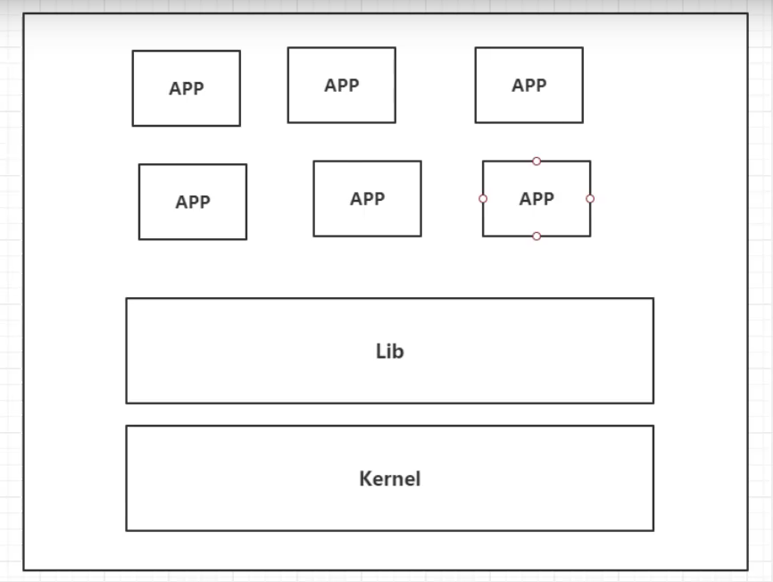
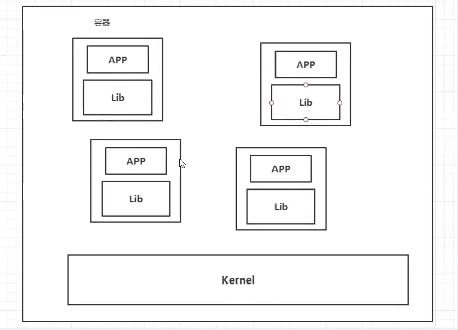
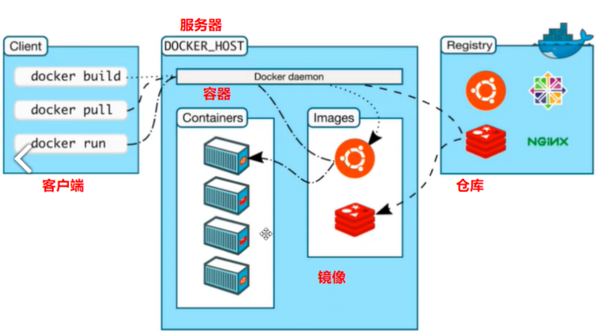
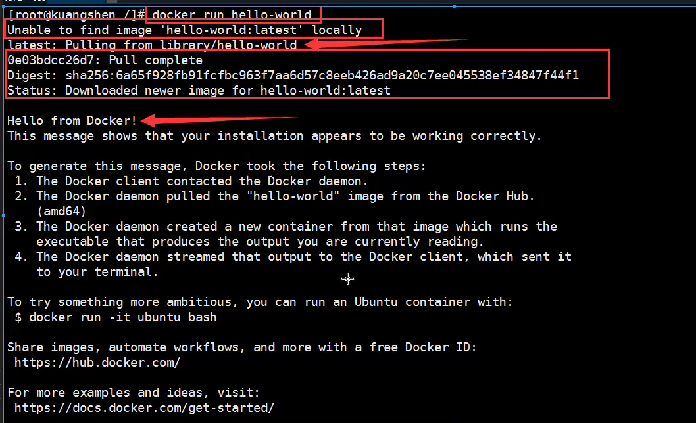
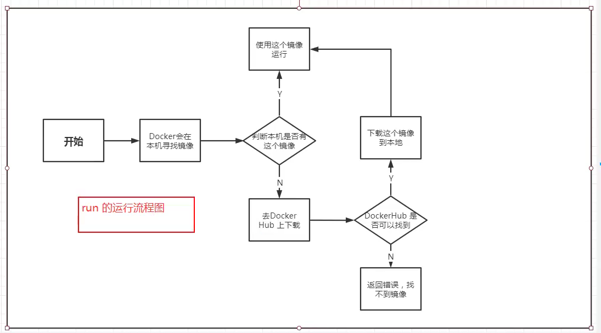
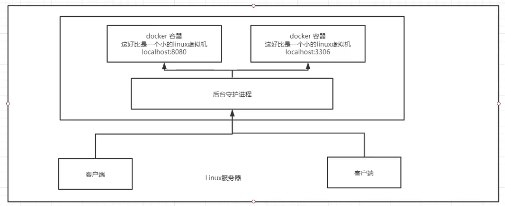
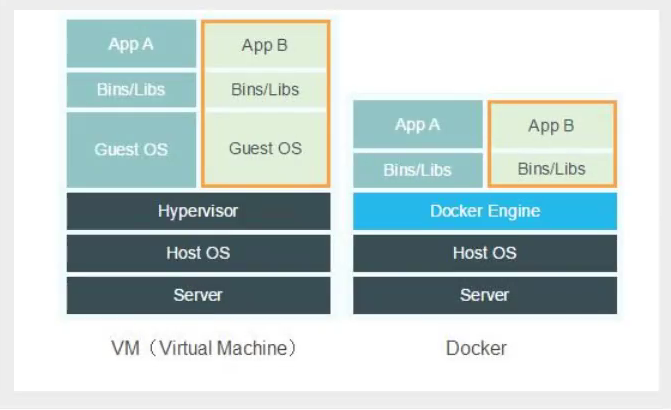

[TOC]

狂神说Docker笔记

视频地址：https://www.bilibili.com/video/BV1og4y1q7M4

# 1.docker学习大纲

>   docker学习

-   docker概述
-   docker安装
-   docker命令
    -   镜像命令
    -   容器命令
    -   操作命令
    -   ...
-   docker镜像
-   容器数据卷
-   .....

# 2.docker为什么会出现

隔离：docker的核心思想。

docker通过隔离机制，可以将linux压榨到极致。

# 3.docker的历史

虚拟机也是属于虚拟化技术，docker容器技术也是一中虚拟化技术。

docker是基于Go的开发的。

==docker文档是超级详细的。==

有个类似github 的，docker hub

# 4.docker能干什么

之前的虚拟机技术：



docker技术：



**docker技术与虚拟机技术的不同：**

-   传统虚拟机，虚拟处一条硬加，运行一个完整的操作系统，然后在这个系统上运行软甲。
-   ==容器内的应用直接运行在宿主机 上，容器没有自己的内核==，也没有虚拟硬件，轻便
-   每个同期是相互隔离，每个容器都有一个属于自己的文件系统，互不影响。


>   DevOps（开发、运维）

# 5.docker安装

## docker组成




镜像（image）

容器（container）

仓库（repository）


# 6.docker安装

>   帮助文档
>
>   这里使用centos

```bash
#1、卸载旧版本
sudo yum remove docker \
                  docker-client \
                  docker-client-latest \
                  docker-common \
                  docker-latest \
                  docker-latest-logrotate \
                  docker-logrotate \
                  docker-engine

#2、需要的安装包
sudo yum install -y yum-utils
#3、设置镜像的仓库
sudo yum-config-manager \
    --add-repo \
    https://download.docker.com/linux/centos/docker-ce.repo#默认是国外的
    #可以搜国内源
sudo yum-config-manager \
    --add-repo \
    http://mirrors.aliyun.com/docker-ce/linux/centos/docker-ce.repo
#4、安装docker相关  //ce社区版   ee业版
sudo yum install docker-ce docker-ce-cli containerd.io

#5、启动docker
systemctl start docker
#6、查看是否安装成功
docker version
#7、hello-world
docker run hello-world
```



```shell
#8、查看下下载的这个hello-world镜像
docker images
```

卸载docker：

```shell 
#1、卸载依赖
sudo yum remove docker-ce docker-ce-cli containerd.io
#2、删除资源
sudo rm -rf /var/lib/docker
sudo rm -rf /var/lib/containerd

/var/lib/docker #docker默认工作路径
```


# 7.配置阿里云镜像加速


# 8.run流程和docker原理




## 底层原理

**docker是怎么工作的？**

docker是一个client-server结构的系统，docker的守护进程运行在主机上。通过socket从客户端访问！

dockerserver接收到docker-client的指令，就会执行这个指令！



**Docker为什么比虚拟机快**

1.  docker有着比虚拟机更少的抽象层
2.  docker利用的是宿主机的内核，vm需要是Guest OS




# 9.镜像的基本/常用命令

## 帮助命令

```shell 
docker version #版本信息
docker info  #系统信息
docker 命令 --help
```

## 镜像命令

**docker images**：查看所有本地的主机上的镜像

```shell
#解释
REPOSITORY：镜像的仓库源
tag: 镜像的标签
image id ：镜像id
created: 镜像的创建时间
size: 镜像大小

#可选项
-a ：列出所有镜像
-q ：只显示镜像id
```

**docker search**：搜索镜像

```shell
docker search mysql
```

**docker pull** ：下载镜像

```
#下载镜像 docker pull 镜像名:tag[]
未加tag的话是最新的

```


