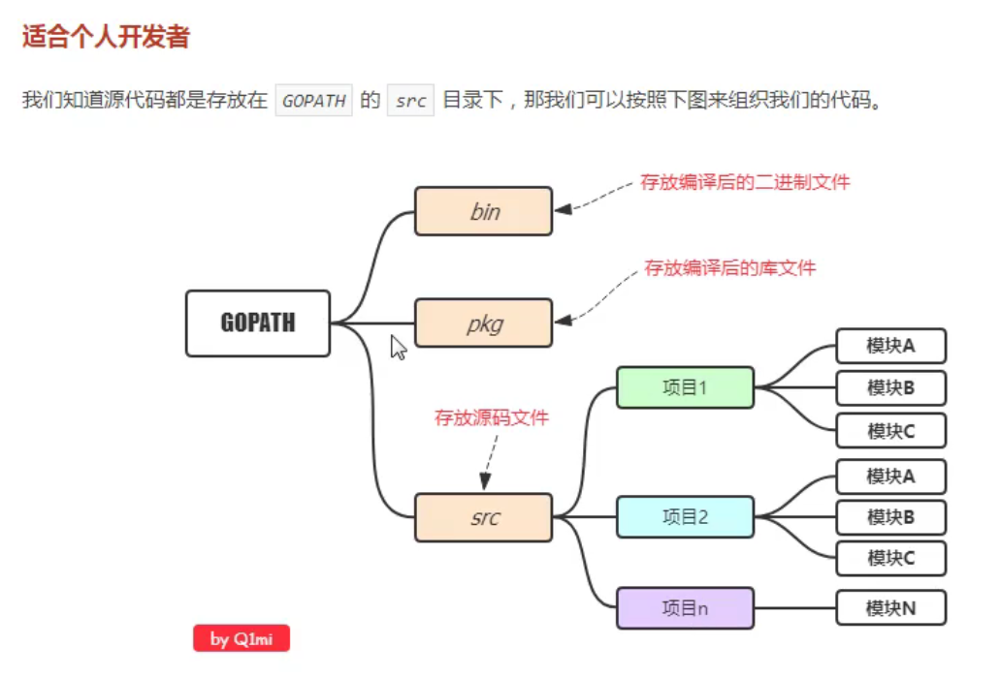
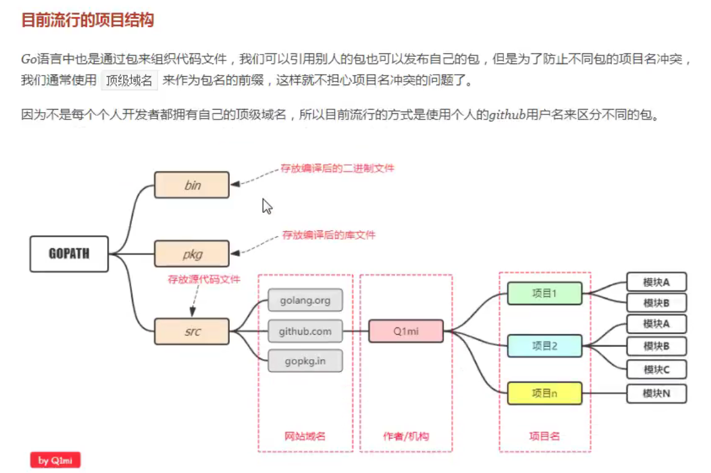
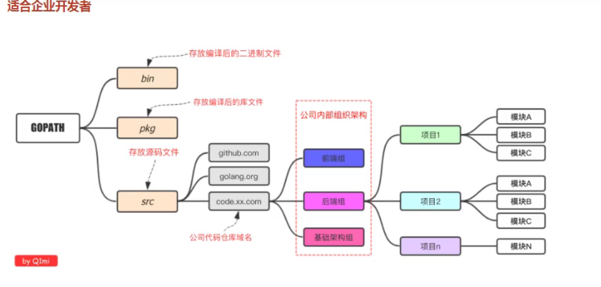

视频学习地址：https://www.bilibili.com/video/BV16E411H7og、

# 1.基础-运算符

## 4.配置GOPATH

步骤：

1.  在电脑创建一个目录（今后放代码的的地方）
2.  在环境变量里面新建GOPATH：目录
3.  新建三个文件夹：src，bin，pkg
4.  将bin的目录加入path环境变量
5.  电脑上GOPATH应该是有 默认值的，通常是`%USERPROFILE%/go`，将这一项删掉，按照上面的步骤新建一个就可以了。

----

查看go相关环境：`go env`

## 5.go项目目录结构介绍








## 6.vscode安装

## 7.第一个代码

编译：go build

go run：像执行脚本文件一样执行文件


```go
package main
import "fmt"
func main(){
    fmt.Println("hello world")
}
```

## 8.变量声明

函数外只能声明，不能写语句

go声明变量的格式：

```go
var 变量名 类型
var  aaa string
var bbb int
var ccc bool
```

批量声明

```go
var (
    var  aaa string
    var bbb int
    var ccc bool
)
```

go语言中变量声明必须使用

```go
print有3个
fmt.Printf()
fmt.Println()
fmt.Print()
```

声明变量同时赋值

```go
var s1 string = "123"
```

类型推导：

```go
var a = 123
```

短变量声明：只能在函数里面用

```go
s3:="hhhh"
```

匿名变量：

```go
x,_:=foo()
//接收但是不用，（占位）
```

## 9.变量赋值

## 10.常量和iota

```go
const pi = 123
const(
	aaa = 123
    bbb = 2123
  
)
```

iota

`iota`是go语言的常量计数器，只能在常量的表达式中使用。

`iota`在const关键字出现时将被重置为0。const中每新增一行常量声明将使`iota`计数一次(iota可理解为const语句块中的行索引)。 使用iota能简化定义，在定义枚举时很有用。

==定义数量级== （这里的`<<`表示左移操作，`1<<10`表示将1的二进制表示向左移10位，也就是由`1`变成了`10000000000`，也就是十进制的1024。同理`2<<2`表示将2的二进制表示向左移2位，也就是由`10`变成了`1000`，也就是十进制的8。）

```go
const (
		_  = iota
		KB = 1 << (10 * iota)
		MB = 1 << (10 * iota)
		GB = 1 << (10 * iota)
		TB = 1 << (10 * iota)
		PB = 1 << (10 * iota)
	)
```

## 11.整形

整型分为以下两个大类： 按长度分为：int8、int16、int32、int64 对应的无符号整型：uint8、uint16、uint32、uint64

其中，`uint8`就是我们熟知的`byte`型，`int16`对应C语言中的`short`型，`int64`对应C语言中的`long`型。

|  类型  |                             描述                             |
| :----: | :----------------------------------------------------------: |
| uint8  |                  无符号 8位整型 (0 到 255)                   |
| uint16 |                 无符号 16位整型 (0 到 65535)                 |
| uint32 |              无符号 32位整型 (0 到 4294967295)               |
| uint64 |         无符号 64位整型 (0 到 18446744073709551615)          |
|  int8  |                 有符号 8位整型 (-128 到 127)                 |
| int16  |              有符号 16位整型 (-32768 到 32767)               |
| int32  |         有符号 32位整型 (-2147483648 到 2147483647)          |
| int64  | 有符号 64位整型 (-9223372036854775808 到 9223372036854775807) |

### 特殊整型

|  类型   |                          描述                          |
| :-----: | :----------------------------------------------------: |
|  uint   | 32位操作系统上就是`uint32`，64位操作系统上就是`uint64` |
|   int   |  32位操作系统上就是`int32`，64位操作系统上就是`int64`  |
| uintptr |              无符号整型，用于存放一个指针              |

`v := 0b00101101`， 代表二进制的 101101，相当于十进制的 45。 `v := 0o377`，代表八进制的 377，相当于十进制的 255。 `v := 0x1p-2`，代表十六进制的 1 除以 2²，也就是 0.25。

而且还允许我们用 `_` 来分隔数字，比如说： `v := 123_456` 表示 v 的值等于 123456。

我们可以借助fmt函数来将一个整数以不同进制形式展示。

==%T ： 查看变量类型==

==%v：无论什么类型的值都能将值打印出来==


## 12.浮点型和布尔

Go语言支持两种浮点型数：`float32`和`float64`。这两种浮点型数据格式遵循`IEEE 754`标准： `float32` 的浮点数的最大范围约为 `3.4e38`，可以使用常量定义：`math.MaxFloat32`。 `float64` 的浮点数的最大范围约为 `1.8e308`，可以使用一个常量定义：`math.MaxFloat64`。


**复数**

complex64和complex128

```go
var c1 complex64
c1 = 1 + 2i
var c2 complex128
c2 = 2 + 3i
fmt.Println(c1)
fmt.Println(c2)
```

复数有实部和虚部，complex64的实部和虚部为32位，complex128的实部和虚部为64位。

**注意：**

1.  布尔类型变量的默认值为`false`。
2.  Go 语言中不允许将整型强制转换为布尔型.
3.  布尔型无法参与数值运算，也无法与其他类型进行转换。


 **多行字符串**

Go语言中要定义一个多行字符串时，就必须使用`反引号`字符：

```go
s1 := `第一行
第二行
第三行
`
fmt.Println(s1)
```

反引号间换行将被作为字符串中的换行，但是所有的转义字符均无效，文本将会原样输出

 **字符串的常用操作**

|                方法                 |      介绍      |
| :---------------------------------: | :------------: |
|              len(str)               |     求长度     |
|           +或fmt.Sprintf            |   拼接字符串   |
|            strings.Split            |      分割      |
|          strings.contains           |  判断是否包含  |
| strings.HasPrefix,strings.HasSuffix | 前缀/后缀判断  |
| strings.Index(),strings.LastIndex() | 子串出现的位置 |
| strings.Join(a[]string, sep string) |    join操作    |


## 13修改字符串和类型转换

要修改字符串，需要先将其转换成`[]rune`或`[]byte`，完成后再转换为`string`。无论哪种转换，都会重新分配内存，并复制字节数组。

```go
func changeString() {
	s1 := "big"
	// 强制类型转换
	byteS1 := []byte(s1)
	byteS1[0] = 'p'
	fmt.Println(string(byteS1))

	s2 := "白萝卜"
	runeS2 := []rune(s2)
	runeS2[0] = '红'
	fmt.Println(string(runeS2))
}
```


# 2.流程控制

if：

```fo
```



