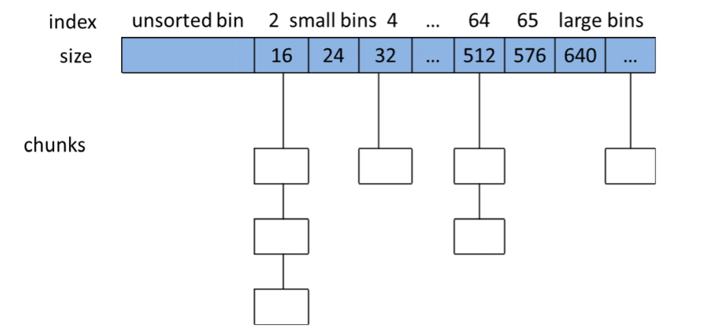

[TOC]


## 2.2操作系统内存分配的相关函数

-   对heap的操作：
    -   操作系统提供brk()函数
    -   c运行是库提供sbrk()函数
-   对mmap营社区的操作：
    -   操作系统提供mmap和munmap函数

### 2.2.1heap操作相关函数

brk()为系统调用，sbrk()为 C 库函数

# 3.概述

### 3.1.1内存管理的方法

1.  c风格的内存管理程序

    主要通过malloc()和free()函数

    内存管理程序主要通过调用brk()或者mmap()进程添加额外的虚拟内存。

2.  池式内存管理

3.  引用计数

4.  垃圾收集


## 3.2ptmalloc内存管理概述

### 3.2.1 简介

ptmalloc 实现了 malloc()，free()以及一组其它的函数. 以提供动态内存管理的支持。分 配器处在用户程序和内核之间，它响应用户的分配请求，向操作系统申请内存，然后将其返 回给用户程序，

### 3.2.3 内存管理数据结构概述

#### 3.2.3.1 Main_arena与non_main_arena

主分配区（main arena），非主分配区（non main arena）.

主分配 区可以访问进程的 heap 区域和 mmap 映射区域，也就是说主分配区可以使用 sbrk 和 mmap 向操作系统申请虚拟内存。而非主分配区只能访问进程的 mmap 映射区域，非主分配区每 次使用 mmap()向操作系统“批发”HEAP_MAX_SIZE（32 位系统上默认为 1MB，64 位系统默 认为 64MB）大小的虚拟内存。

#### 3.2.3.2 chunk

amp中：

-   M表示前一个快是否在使用中，p为0表示前一个chunk为空闲，这时prev_size有效，可以通过prev_size来寻找。

-   M表示当前chunk是从哪个内存区获得的虚拟内存，为1表示从mmap映射区分配的，否则是从heap区域分配的。
-   A表示该chunk是否属于主分配区或者非主分配区，如 果属于非主分配区，将该位置为 1，否则置为 0。

#### 3.2.3.3 空闲 chunk 容器

1.  **Bins**

    用户free掉的内存不会马上给系统。

    ptmalloc 将相似大小的 chunk 用双向链表链接起来，这样的一个链表被称为一个 bin。Ptmalloc 一共 维护了 128 个 bin，并使用一个数组来存储这些 bin（如下图所示）。



​	数组中的第一个是unsorted bin；之后的64个bin是small bin，同一个small bin大小相同，相邻的small bin中的chunk大小相差8bytes。

​	small bins 中的 chunk 按照最近使用顺序进行排列（FIFO），最后释放的 chunk 被链接到链表的头部， 而申请 chunk 是从链表尾部开始

​	large bins 中的每一个 bin 分别包含了一个给定范围 内的 chunk，其中的 chunk 按大小序排列。相同大小的 chunk 同样按照最近使用顺序排列。

​	当空闲的 chunk 被链接到 bin 中的时候，ptmalloc 会把表示该 chunk 是否处于使用中的 标志 P 设为 0（注意，这个标志实际上处在下一个 chunk 中），同时 ptmalloc 还会检查它前 后的 chunk 是否也是空闲的，如果是的话，ptmalloc 会首先把它们合并为一个大的 chunk， 然后将合并后的 chunk 放到 unstored bin 中。要注意的是，并不是所有的 chunk 被释放后就 立即被放到 bin 中。ptmalloc 为了提高分配的速度，会把一些小的的 chunk 先放到一个叫做 fast bins 的容器内。

2.  **Fast bin**

​	fast bins 中的 chunk 并不改变它的使用标志 P，这样也就无法将它们合并。

​	在某个特定的时候，ptmalloc会遍历fast bins中的chunk，将相邻的空闲 chunk 进行合并，并将合并后的 chunk 加入 unsorted bin 中，然后再将 usorted bin 里的 chunk 加入 bins 中。

3.  **unsorted bin**

​	unsorted bin 的队列使用 bins 数组的第一个，如果被用户释放的 chunk 大于 max_fast， 或者 fast bins 中的空闲 chunk 合并后，这些 chunk 首先会被放到 unsorted bin 队列中，在进 行 malloc 操作的时候，如果在 fast bins 中没有找到合适的 chunk，则 ptmalloc 会先在 unsorted bin 中查找合适的空闲 chunk，然后才查找 bins。

​	如果 unsorted bin 不能满足分配要求。malloc 便会将 unsorted bin 中的 chunk 加入 bins 中。然后再从 bins 中继续进行查找和分配过程。从 这个过程可以看出来，unsorted bin 可以看做是 bins 的一个缓冲区，增加它只是为了加快分 配的速度。

4.   TOPchunk

​    并不是所有的 chunk 都按照上面的方式来组织，实际上，有三种例外情况。Top chunk， mmaped chunk 和 last remainder。

5.   mmaped chunk

​    当需要分配的 chunk 足够大，而且 fast bins 和 bins 都不能满足要求，甚至 top chunk 本 身也不能满足分配需求时，ptmalloc 会使用 mmap 来直接使用内存映射来将页映射到进程空间。

6.  Last remainder

​    Last remainder 是另外一种特殊的 chunk，就像 top chunk 和 mmaped chunk 一样，不会 在任何 bins 中找到这种 chunk。当需要分配一个 small chunk，但在 small bins 中找不到合适 的 chunk，如果 last remainder chunk 的大小大于所需的 small chunk 大小，last remainder chunk 被分裂成两个 chunk，其中一个 chunk 返回给用户，另一个 chunk 变成新的 last remainder chuk。

#### 3.2.3.4 sbrk与mmap

​    .bss 段之上的这块分配给用户程序的空间被称为 heap。 

​     ==**start_brk 指向 heap 的开始**，而 **brk 指向 heap 的顶部**==。

​    可以使用系统调用 brk()和 sbrk()来增 加标识 heap 顶部的 brk 值，从而线性的增加分配给用户的 heap 空间。

​    在使 malloc 之前， brk的值等于start_brk，也就是说heap大小为0。

​    ptmalloc在开始时，若请求的空间小于 mmap 分配阈值（mmap threshold，默认值为 128KB）时，主分配区会调用 sbrk()增加一块大小为 (128 KB + chunk_size) align 4KB 的空间作为 heap。非主分配区会调用 mmap 映射一块大小为 HEAP_MAX_SIZE（32 位系统上默认为 1MB，64 位系统上默认为 64MB）的空间作为 sub-heap。 这就是前面所说的 ptmalloc 所维护的分配空间，当用户请求内存分配时，首先会在这个区 域内找一块合适的 chunk 给用户。当用户释放了 heap 中的 chunk 时，ptmalloc 又会使用 fast bins 和 bins 来组织空闲 chunk。以备用户的下一次分配。若需要分配的 chunk 大小小于 mmap 分配阈值，而 heap 空间又不够，则此时主分配区会通过 sbrk()调用来增加 heap 大小，非主 分配区会调用 mmap 映射一块新的 sub-heap，也就是增加 top chunk 的大小，每次 heap 增 加的值都会对齐到 4KB。

### 3.2.4 内存分配概述

-   ptmalloc 的响应用户内存分配要求的具体步骤：

1) 获取分配区的锁，为了防止多个线程同时访问同一个分配区，在进行分配之前需要 取得分配区域的锁。线程先查看线程私有实例中是否已经存在一个分配区，如果存 在尝试对该分配区加锁，如果加锁成功，使用该分配区分配内存，否则，该线程搜 索分配区循环链表试图获得一个空闲（没有加锁）的分配区。如果所有的分配区都 已经加锁，那么 ptmalloc 会开辟一个新的分配区，把该分配区加入到全局分配区循 环链表和线程的私有实例中并加锁，然后使用该分配区进行分配操作。开辟出来的 新分配区一定为非主分配区，因为主分配区是从父进程那里继承来的。开辟非主分 配区时会调用 mmap()创建一个 sub-heap，并设置好 top chunk。 

2) 将用户的请求大小转换为实际需要分配的 chunk 空间大小。 

3) 判断所需分配chunk的大小是否满足chunk_size <= max_fast (max_fast 默认为 64B)， 如果是的话，则转下一步，否则跳到第 5 步。 

4) 首先尝试在 fast bins 中取一个所需大小的 chunk 分配给用户。如果可以找到，则分 配结束。否则转到下一步。 

5) 判断所需大小是否处在 small bins 中，即判断 chunk_size < 512B 是否成立。如果 chunk 大小处在 small bins 中，则转下一步，否则转到第 6 步。 

6) 根据所需分配的 chunk 的大小，找到具体所在的某个 small bin，从该 bin 的尾部摘 取一个恰好满足大小的 chunk。若成功，则分配结束，否则，转到下一步。 

7) 到了这一步，说明需要分配的是一块大的内存，或者 small bins 中找不到合适的 chunk。于是，ptmalloc 首先会遍历 fast bins 中的 chunk，将相邻的 chunk 进行合并， 并链接到 unsorted bin 中，然后遍历 unsorted bin 中的 chunk，如果 unsorted bin 只 有一个 chunk，并且这个 chunk 在上次分配时被使用过，并且所需分配的 chunk 大 小属于 small bins，并且 chunk 的大小大于等于需要分配的大小，这种情况下就直 接将该 chunk 进行切割，分配结束，否则将根据 chunk 的空间大小将其放入 small bins 或是 large bins 中，遍历完成后，转入下一步。 

8) 到了这一步，说明需要分配的是一块大的内存，或者 small bins 和 unsorted bin 中 都找不到合适的 chunk，并且 fast bins 和 unsorted bin 中所有的 chunk 都清除干净 了。从 large bins 中按照“smallest-first，best-fit”原则，找一个合适的 chunk，从 中划分一块所需大小的 chunk，并将剩下的部分链接回到 bins 中。若操作成功，则 分配结束，否则转到下一步。 

9) 如果搜索 fast bins 和 bins 都没有找到合适的 chunk，那么就需要操作 top chunk 来 进行分配了。判断 top chunk 大小是否满足所需 chunk 的大小，如果是，则从 top chunk 中分出一块来。否则转到下一步。 

10) 到了这一步，说明 top chunk 也不能满足分配要求，所以，于是就有了两个选择: 如 果是主分配区，调用 sbrk()，增加 top chunk 大小；如果是非主分配区，调用 mmap 来分配一个新的 sub-heap，增加 top chunk 大小；或者使用 mmap()来直接分配。在 这里，需要依靠 chunk 的大小来决定到底使用哪种方法。判断所需分配的 chunk 大小是否大于等于 mmap 分配阈值，如果是的话，则转下一步，调用 mmap 分配， 否则跳到第 12 步，增加 top chunk 的大小。 

11) 使用 mmap 系统调用为程序的内存空间映射一块 chunk_size align 4kB 大小的空间。 然后将内存指针返回给用户。 

12) 判断是否为第一次调用 malloc，若是主分配区，则需要进行一次初始化工作，分配 21 一块大小为(chunk_size + 128KB) align 4KB 大小的空间作为初始的 heap。若已经初 始化过了，主分配区则调用 sbrk()增加 heap 空间，分主分配区则在 top chunk 中切 割出一个 chunk，使之满足分配需求，并将内存指针返回给用户。


### 3.2.5 内存回收概述

free() 函数接受一个指向分配区域的指针作为参数，释放该指针所指向的 chunk。

free()函数的工作步骤入下：

1) free()函数同样首先需要获取分配区的锁，来保证线程安全。 

2) 判断传入的指针是否为 0，如果为 0，则什么都不做，直接 return。否则转下一步。 

3) 判断所需释放的 chunk 是否为 mmaped chunk，如果是，则调用 munmap()释放 mmaped chunk，解除内存空间映射，该该空间不再有效。如果开启了 mmap 分配 阈值的动态调整机制，并且当前回收的 chunk 大小大于 mmap 分配阈值，将 mmap 分配阈值设置为该 chunk 的大小，将 mmap 收缩阈值设定为 mmap 分配阈值的 2 倍，释放完成，否则跳到下一步。 

4) 判断 chunk 的大小和所处的位置，若 chunk_size <= max_fast，并且 chunk 并不位于 heap 的顶部，也就是说并不与 top chunk 相邻，则转到下一步，否则跳到第 6 步。 （因为与 top chunk 相邻的小 chunk 也和 top chunk 进行合并，所以这里不仅需要 判断大小，还需要判断相邻情况） 

5) 将 chunk 放到 fast bins 中，chunk 放入到 fast bins 中时，并不修改该 chunk 使用状 态位 P。也不与相邻的 chunk 进行合并。只是放进去，如此而已。这一步做完之后 释放便结束了，程序从 free()函数中返回。 

6) 判断前一个 chunk 是否处在使用中，如果前一个块也是空闲块，则合并。并转下一 步。 

7) 判断当前释放 chunk 的下一个块是否为 top chunk，如果是，则转第 9 步，否则转 下一步。 

8) 判断下一个 chunk 是否处在使用中，如果下一个 chunk 也是空闲的，则合并，并将 22 合并后的 chunk 放到 unsorted bin 中。注意，这里在合并的过程中，要更新 chunk 的大小，以反映合并后的 chunk 的大小。并转到第 10 步。 

9) 如果执行到这一步，说明释放了一个与 top chunk 相邻的 chunk。则无论它有多大， 都将它与 top chunk 合并，并更新 top chunk 的大小等信息。转下一步。 

10) 判断合并后的 chunk 的大小是否大于 FASTBIN_CONSOLIDATION_THRESHOLD（默认 64KB），如果是的话，则会触发进行 fast bins 的合并操作，fast bins 中的 chunk 将被 遍历，并与相邻的空闲 chunk 进行合并，合并后的 chunk 会被放到 unsorted bin 中。 fast bins 将变为空，操作完成之后转下一步。 

11) 判断 top chunk 的大小是否大于 mmap 收缩阈值（默认为 128KB），如果是的话，对 于主分配区，则会试图归还 top chunk 中的一部分给操作系统。但是最先分配的 128KB 空间是不会归还的，ptmalloc 会一直管理这部分内存，用于响应用户的分配 请求；如果为非主分配区，会进行 sub-heap 收缩，将 top chunk 的一部分返回给操 作系统，如果 top chunk 为整个 sub-heap，会把整个 sub-heap 还回给操作系统。做 完这一步之后，释放结束，从 free() 函数退出。可以看出，收缩堆的条件是当前 free 的 chunk 大小加上前后能合并 chunk 的大小大于 64k，并且要 top chunk 的大 小要达到 mmap 收缩阈值，才有可能收缩堆。


# 5.源代码分析

主要分析的文件包括 arena.c 和 malloc.c。

其中 arena.c 主要是对多线程支持的实现，malloc.c 定义了公用的 malloc()，free()等函数。

## 5.1 边界标记法

ptmalloc 依赖平台 定义的 size_t 长度，对于 32 位平台，size_t 长度为 4 字节，对 64 位平台，size_t 长度可能为 4 字节，也可能为 8 字节。

Ptmalloc 使用宏来屏蔽不同平台的差异，将 INTERNAL_SIZE_T 定义为 size_t，SIZE_SZ 定义为 size_t 的大小，在 32 位平台下位 4 字节，在 64 位平台下位 4 字节或者 8 字节。另 外分配 chunk 时必须以 2*SIZE_SZ 对齐。

```c
struct malloc_chunk {
 INTERNAL_SIZE_T prev_size; /* Size of previous chunk (if free). */
 INTERNAL_SIZE_T size; /* Size in bytes, including overhead. */
 struct malloc_chunk* fd; /* double links -- used only if free. */
 struct malloc_chunk* bk;
 /* Only used for large blocks: pointer to next larger size. */
 struct malloc_chunk* fd_nextsize; /* double links -- used only if free. */
 struct malloc_chunk* bk_nextsize;
};

```

```c
/* conversion from malloc headers to user pointers, and back */
#define chunk2mem(p) ((Void_t*)((char*)(p) + 2*SIZE_SZ))
#define mem2chunk(mem) ((mchunkptr)((char*)(mem) - 2*SIZE_SZ))
```

对于已经分配的 chunk，通过 chunk2mem 宏根据 chunk 地址获得返回给用户的内存地 址，反过来通过 mem2chunk 宏根据 mem 地址得到 chunk 地址。

## 5.2 分箱式内存管理

### 5.2.1 Small bins

`Chunk_size=2 * SIZE_SZ * index`

​	在 SIZE_SZ 为 4B 的平台上，small bins 中的 chunk 大小是以 8B 为公差的等差数列，最大 的 chunk 大小为 504B，最小的 chunk 大小为 16B，所以==实际共 62 个 bin==。分别为 16B、24B、 32B...504B。在 SIZE_SZ 为 8B 的平台上，small bins 中的 chunk 大小是以 16B 为公差 的等差数列，最大的 chunk 大小为 1008B，最小的 chunk 大小为 32B，所以实际共 62 个 bin。 分别为 32B、48B、64B.....1008B。

### 5.2.2 Large bins

​	在 SIZE_SZ 为 4B 的平台上，大于等于 512B 的空闲 chunk，或者，在 SIZE_SZ 为 8B 的平 台上，大小大于等于 1024B 的空闲 chunk，由 sorted bins 管理。Large bins 一共包括 63 个 bin， 每个 bin 中的 chunk 大小不是一个固定公差的等差数列，而是分成 6 组 bin，每组 bin 是一个 固定公差的等差数列，==每组的 bin 数量依次为 32、16、8、4、2、1，公差依次为 64B、512B、 4096B、32768B、262144B 等==。

​	以 SIZE_SZ 为 4B 的平台为例，第一个 large bin 的起始 chunk 大小为 512B，共 32 个 bin， 公差为 64B，等差数列满足如下关系： Chunk_size=512 + 64 * index 第二个 large bin 的起始 chunk 大小为第一组 bin 的结束 chunk 大小，满足如下关系： Chunk_size=512 + 64 * 32 + 512 * index

​	对于 SIZE_SZ 为 4B 的平台，bin[0]和 bin[1]是不存在的，因为最小的 chunk 为 16B，small bins 一共 62 个，large bins 一共 63 个，加起来一共 125 个 bin。而 NBINS 定义为 128，其实 bin[0]和 bin[127]都不存在，bin[1]为 unsorted bin 的 chunk 链表头。

### 5.2.3 Unsorted bin

​	Unsorted bin 可以看作是 small bins 和 large bins 的 cache，只有一个 unsorted bin，以双 向链表管理空闲 chunk，空闲 chunk 不排序，所有的 chunk 在回收时都要先放到 unsorted bin 41 中，==分配时，如果在 unsorted bin 中没有合适的 chunk，就会把 unsorted bin 中的所有 chunk 分别加入到所属的 bin 中，然后再在 bin 中分配合适的 chunk。==Bins 数组中的元素 bin[1]用于 存储 unsorted bin 的 chunk 链表头。

###  5.2.4 Fast bins

​	对于 SIZE_SZ 为 4B 的平台，fast bins 有 7 个 chunk 空闲链表（bin），每个 bin 的 chunk 大小依次为 16B，24B，32B，40B，48B，56B，64B；对 于 SIZE_SZ 为 8B 的平台，fast bins 有 7 个 chunk 空闲链表（bin），每个 bin 的 chunk 大小依 次为 32B，48B，64B，80B，96B，112B，128B。

## 5.3 核心结构体分析

每个分配区是 struct malloc_state 的一个实例，ptmalloc 使用 malloc_state 来管理分配区， 而参数管理使用 struct malloc_par，全局拥有一个唯一的 malloc_par 实例。

### 5.3.1 malloc_state

```c
struct malloc_state {
 /* Serialize access. */
 mutex_t mutex;
 /* Flags (formerly in max_fast). */
 int flags;
#if THREAD_STATS
 /* Statistics for locking. Only used if THREAD_STATS is defined. */
 long stat_lock_direct, stat_lock_loop, stat_lock_wait;
#endif
 /* Fastbins */
 mfastbinptr fastbinsY[NFASTBINS];
 /* Base of the topmost chunk -- not otherwise kept in a bin */
 mchunkptr top;
 /* The remainder from the most recent split of a small request */
 mchunkptr last_remainder;
 /* Normal bins packed as described above */
 mchunkptr bins[NBINS * 2 - 2];
 /* Bitmap of bins */
45
 unsigned int binmap[BINMAPSIZE];
 /* Linked list */
 struct malloc_state *next;
#ifdef PER_THREAD
 /* Linked list for free arenas. */
 struct malloc_state *next_free;
#endif
 /* Memory allocated from the system in this arena. */
 INTERNAL_SIZE_T system_mem;
 INTERNAL_SIZE_T max_system_mem;
};
```

-   fastbinsY 拥有 10（NFASTBINS）个元素的数组，用于存放每个 fast chunk 链表头指针， 所以 fast bins 最多包含 10 个 fast chunk 的单向链表。

-   top 是一个 chunk 指针，指向分配区的 top chunk。
-   last_remainder 是一个 chunk 指针，分配区上次分配 small chunk 时，从一个 chunk 中分 裂出一个 small chunk 返回给用户，分裂后的剩余部分形成一个 chunk，last_remainder 就是 指向的这个 chunk。

-   bins 用于存储 unstored bin，small bins 和 large bins 的 chunk 链表头，small bins 一共 62 个，large bins 一共 63 个，加起来一共 125 个 bin。而 NBINS 定义为 128，其实 bin[0]和 bin[127] 都不存在，bin[1]为 unsorted bin 的 chunk 链表头，所以实际只有 126bins。

.

.

.

.

.

## 5.5ptmalloc的初始化

P53页
