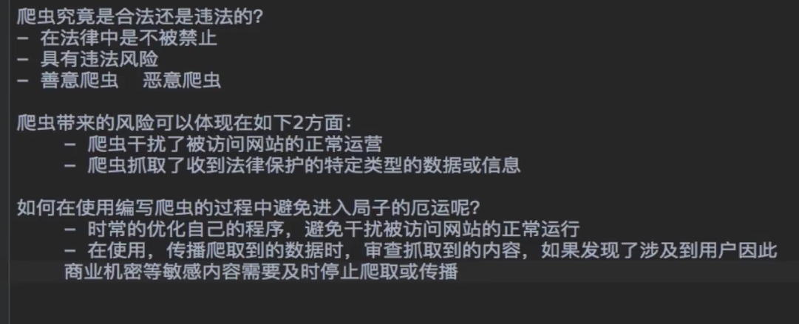
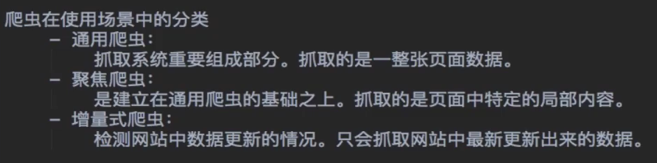
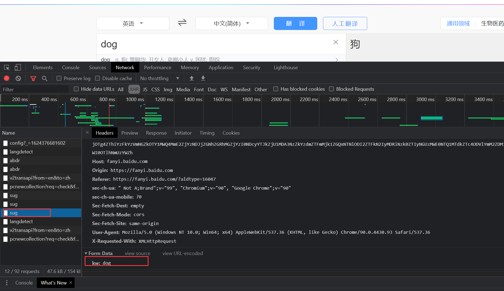
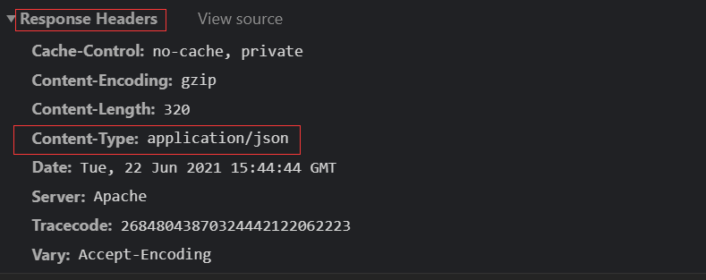
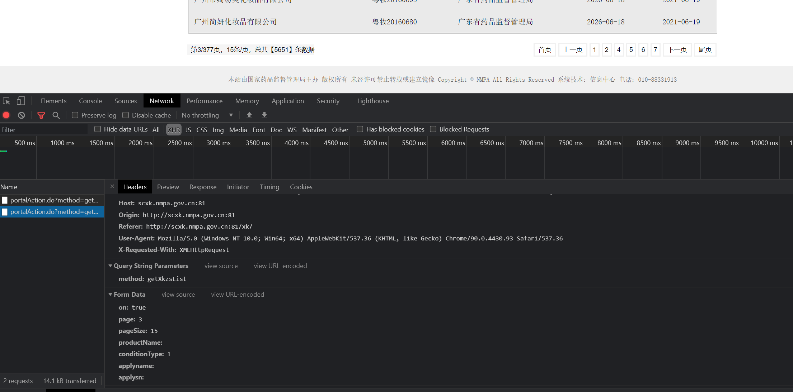
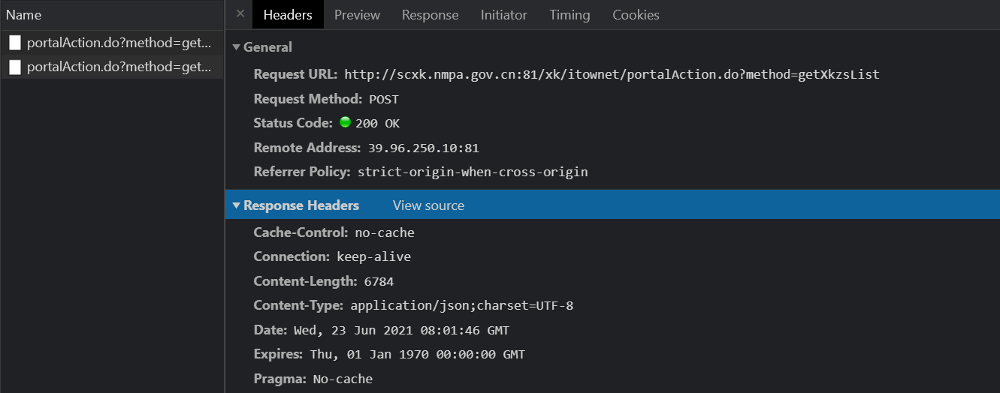

[TOC]


之前看了好几次的爬虫的视频，结果无一例外都没坚持下去，这次必搞完

视频地址：https://www.bilibili.com/video/BV1Yh411o7Sz

# 1.爬虫简介

# 2.爬虫合法性探究



# 3.爬虫初始深入



# 4.http&https协议

**常用请求头信息**

```
User-Agent：请求载体的身份标识
Connection：请求完毕后，是乱开链接还是保持连接
```

**常用相应头信息**

```
Content-Type：服务器相应回客户端的数据类型
```


**加密方式**

```
对称密钥加密
非对称密钥加密
证书加密
```

# 5.request第一血

request模块：

-   urllib模块
-   request模块（主要）

--------------

request模块作用：模拟浏览器发型请求

如何使用：

-   指定url
-   发起请求
-   获取相应数据
-   持久化存储


# 6.requests巩固深入案例介绍

接下来几节课要写的代码

# 7.requests简易网页采集器

具体代码在：

>    code/02.requests之网页采集器.py


# 8.requests之破解百度翻译

涉及到ajax

AJAX 是一种在无需重新加载整个网页的情况下，能够更新部分网页的技术。

AJAX 不是新的编程语言，而是一种使用现有标准的新方法。

AJAX 是与服务器交换数据并更新部分网页的艺术，在不重新加载整个页面的情况下。





post请求，相应数据是json数据

# 9.requests之豆瓣电影爬取

具体代码在code文件夹下

# 10.作业

作业url：http://www.kfc.com.cn/kfccda/storelist/index.aspx

# 11. 综合练习-药监总局01

 药监总局地址：http://scxk.nmpa.gov.cn:81/xk/



ajax



# 12.综合练习-药监总局02

# 13.综合练习-药监总局03screenflow

# 14.综合练习-药监总局04screenflow

# 15.总结回顾

接下来要讲的：

-   聚焦爬虫
-   正则
-   bs4
-   xpath

# 16.数据解析概述

 数据解析分类：

-   正则
-   bs4
-   xpath

# 17.图片数据爬取

见0.图片爬取.py

# 18.正则解析案例01

# 20.bs4解析


