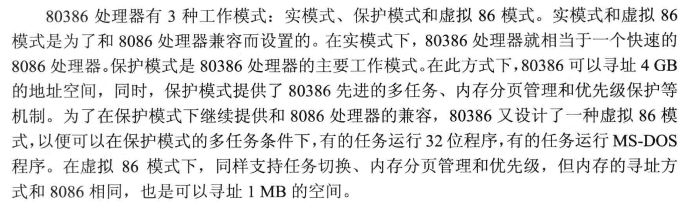
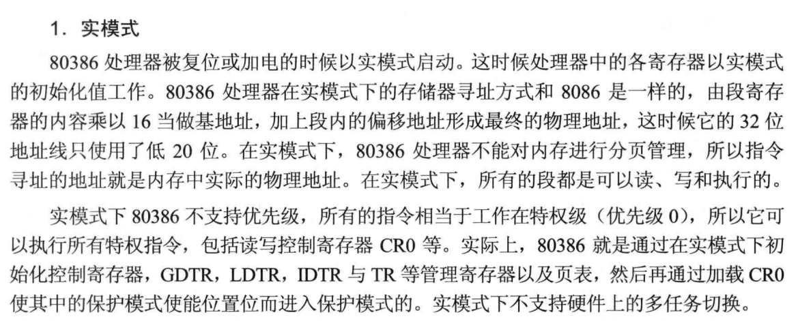
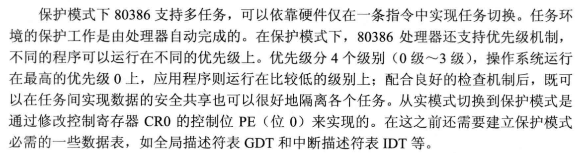
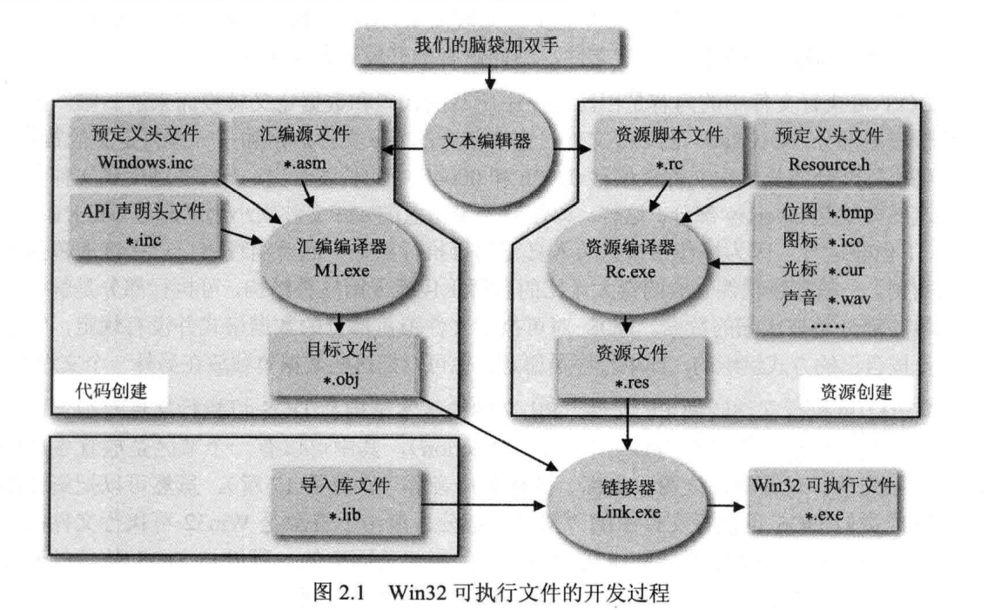

[TOC]


# 第一章 背景知识

## 1.3 基础知识

### 1.3.1  80x86处理器的工作模式

```
三种工作模式：
实模式、保护模式、虚拟86模式
```








### 1.3.2 Windows的内存管理


# 第二章 准备环境



就是masm安装和bat之类的。

```sh
@echo off
rem 请根据 Masm32 软件包的安装目录修改下面的 Masm32Dir 环境变量！
set Masm32Dir=C:\Masm32
set include=%Masm32Dir%\Include;%include%
set lib=%Masm32Dir%\lib;%lib%
set path=%Masm32Dir%\Bin;%Masm32Dir%;%PATH%
set Masm32Dir=
echo on
```


# 第三章 使用NASM


