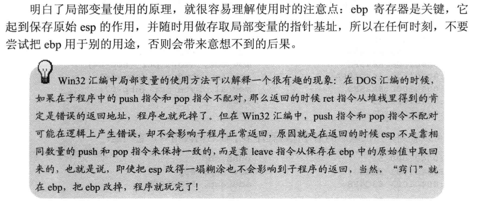

[TOC]


# 第一章 背景知识

## 1.3 基础知识

### 1.3.1  80x86处理器的工作模式

```
三种工作模式：
实模式、保护模式、虚拟86模式
```


### 1.3.2 Windows的内存管理


# 第二章 准备环境


就是masm安装和bat之类的。

```sh
@echo off
rem 请根据 Masm32 软件包的安装目录修改下面的 Masm32Dir 环境变量！
set Masm32Dir=C:\Masm32
set include=%Masm32Dir%\Include;%include%
set lib=%Masm32Dir%\lib;%lib%
set path=%Masm32Dir%\Bin;%Masm32Dir%;%PATH%
set Masm32Dir=
echo on
```


# 第三章 使用NASM

## 3.1 win32汇编源程序的结构

win32版hello world：

```assembly
;>>>>>>>>>>>>>>>>>>>>>>>>>>>>>>>>>>>>>>>>>>>>>>>>>>>>>>>>>>>>>>>>>>>>
; 使用 nmake 或下列命令进行编译和链接:
; ml /c /coff Test.asm
; rc Test.rc
; Link /subsystem:windows Test.obj Test.res
;>>>>>>>>>>>>>>>>>>>>>>>>>>>>>>>>>>>>>>>>>>>>>>>>>>>>>>>>>>>>>>>>>>>>
		.386
		.model flat,stdcall
		option casemap:none
;>>>>>>>>>>>>>>>>>>>>>>>>>>>>>>>>>>>>>>>>>>>>>>>>>>>>>>>>>>>>>>>>>>>>
; Include 文件定义
;>>>>>>>>>>>>>>>>>>>>>>>>>>>>>>>>>>>>>>>>>>>>>>>>>>>>>>>>>>>>>>>>>>>>
include		windows.inc
include		user32.inc
includelib	user32.lib
include		kernel32.inc
includelib	kernel32.lib
;>>>>>>>>>>>>>>>>>>>>>>>>>>>>>>>>>>>>>>>>>>>>>>>>>>>>>>>>>>>>>>>>>>>>
; 数据段
;>>>>>>>>>>>>>>>>>>>>>>>>>>>>>>>>>>>>>>>>>>>>>>>>>>>>>>>>>>>>>>>>>>>>
		.const

szCaption	db	'恭喜',0
szText		db	'当您看到这个信息的时候，您已经可以编译Win32汇编程序了!',0

;>>>>>>>>>>>>>>>>>>>>>>>>>>>>>>>>>>>>>>>>>>>>>>>>>>>>>>>>>>>>>>>>>>>>
; 代码段
;>>>>>>>>>>>>>>>>>>>>>>>>>>>>>>>>>>>>>>>>>>>>>>>>>>>>>>>>>>>>>>>>>>>>
		.code
start:
		invoke	MessageBox,NULL,offset szText,offset szCaption,MB_OK
		invoke	ExitProcess,NULL
;>>>>>>>>>>>>>>>>>>>>>>>>>>>>>>>>>>>>>>>>>>>>>>>>>>>>>>>>>>>>>>>>>>>>
		end	start
```

makefile中的内容：

```makefile
EXE = Test.exe		#指定输出文件
OBJS = Test.obj		#需要的目标文件
LINK_FLAG = /subsystem:windows	#连接选项
ML_FLAG = /c /coff		#编译选项
$(EXE): $(OBJS) $(RES)
	Link $(LINK_FLAG) $(OBJS) $(RES)
.asm.obj:
	ml $(ML_FLAG) $<
.rc.res:
	rc $<
clean:
	del *.obj
	del *.res
```

### 3.1.1 模式定义

```assembly
.386
.model flat,stdcall
option casemap:none
```

这些指令定义了程序使用的指令集、工作模式和格式

1.  指令使用的指令集

    .386 语句是汇编语言的伪指令。

    类似的还有.8086， .186等等等。

2.  .model 语句

    用来定于程序工作的工作模式，使用方法：

    ```assembly
    .model 内存模式[,语言模式] [其他模式]
    ```

    

3.  option语句

    这个语句定义了程序中的变量和子程序名是否对大小写敏感，Win32中的API大小写敏感，所以必须写


### 3.1.2 段的定义

1.  段的概念

    .stack  .data  .data? .code 等都是分段的伪指令，win32中实际上只有代码和数据之分，win32汇编不用考虑堆栈所以

    .stack的定义通常被忽略。

2.  数据段

    可读可写的已定义变量，可读可写的未定义变量，常量。

    比如要用一个100kb的缓冲区，可以：

    ```assembly
    szBuffer	db	100 * 1024 dup(?)
    ```

    

### 3.1.3 程序结束和程序入口

```assembly
end [开始地址]

比如：
end start
```

### 3.1.4 注释和换行

注释使用分号

换行使用反斜杠

## 3.2 调用API

int 21h是DOS中断

int 13h和int 10h是BIOS中的磁盘中昂段和视频中断


```c
int MessageBox(
	HWND hWnd,
    LPCTSTR lptext,
    LPCTSTR lpcaption,
    UINT utype
);
```

使用汇编就是：

```asm
push utype
push lpcaption
push lptext
push hwnd
call MessageBox
```

1.  使用invoke语句

    ```asm
    invoke 函数名[,参数1] [，参数2]...
    例如
    invoke MessageBox,NULL,offset szText,offset,szcaption,MB_OK
    ```

2.  API函数的返回值

    如果返回值eax可以容纳，就放入eax中；

    若不能容纳，则返回指针，eax。

3.  include语句

4.  includelib语句

### 3.2.3 API参数中的等值定义


## 3.3 标号、变量和数据结构


### 3.3.1 标号

1.  标号的定义

当在程序中使用一条跳转指令的时候，可以用标号来表示跳转的目的地，编译器在编
译的时候会把它替换成地址，标号既可以定义在目的指令同--行的头部，也可以在目的指
令前一行单独用一行定义，标号定义的格式是:

>   标号名：	目的指令	;方法1
>
>   或者
>
>   标号名：：	目的指令	;方法2

常用的方式是方法1（一个冒号）；当需要从一个子程序调到另外一个子程序中的标号时，可以使用方法2.

2.  MASM中的@@


### 3.3.2 全局变量

1.  全局变量的定义

    格式

    >   变量名		类型		初始值1，初始值2......
    >
    >   变量名		类型		重复数量 dup (初始值1，初始值2,..........)

变量类型见下表：


几个例子：

```assembly
.data
wHour		dw	?	;定义了一个未初始化的word变量名称为wHour
wMinute		dw	10	;定义了一个word类型的变量，wMinute=10
_hWnd		dd	?	;
word_Buffer	dw	100 dup (1,2)
;定义了一组数字，以0001,0002,0001,0002...的顺序重复100遍，共200个字
szBuffer	byte	1024 dup (?);定义了1024字节大小的缓冲区
sztext		db		'hello world';定义字符串
```

若是想要换行：

```assembly
szText		db		'hello world',0dh,0ah,'helloagain',0dh,0ah,0
```


### 3.3.3 局部变量

1.  局部变量的定义

    `local	变量名1[[重复数量]] [:类型],变量名2[[重复数量]] [:类型]....`

    local伪指令必须紧接在子程序定义的伪指令proc后、其他指令开始前。

    举例：

    ```asm
    local	loc1[1024] :byte 	;1024字节长的局部变量loc1
    local	loc2			  	;默认类型是DWORD
    local 	loc3:WNDCLASS		;定义了一个WNDCLASS数据结构，loc3
    ```

    局部变量使用的例子：

    ```asm
    TestProc proc
    	local	@loc1:dword,@loc2:word
    	local	@loc3:byte
    	
    	mov		eax,@loc1
    	mov		ax,@loc2
    	mov		al,@loc3
    TestProc	end
    ```

    ==执行call指令后，CPU会把返回地址压入堆栈==

    ==mov esp,ebp;popebp \=\=\=  leave==

    

2.  局部变量的初始化值

### 3.3.4 数据结构

```c
//就是类似下面的
typedef struct __aaa{
	int a;
    float b;
    ...;
    ...;
}aaa
```

上述是C语言的格式，汇编如下写：

```asm
结构名	struct
字段1		类型		?
字段2		类型		?
字段3		类型		?
字段4		类型		?
。。。。。。
结构名 ends
```

```asm
aaa		struct

a		dword	?
b		dword	?
c		dword	?

aaa		ends
```

一般情况下所有的结构体在Windows.inc文件找那个都有定义了。

使用数据结构在数据段中定义数据的方法如下：

```asm
	.data
stWndClass	WNDCLASS	<>
	.....
;或者：
	.data
stWndClass	WNDCLASS 	<1,1,1,1,1,1,1,1>
	.....
```

若要使用stWndclass中的lpfnWndProc字段，最直接的办法：

```asm
mov	eax,stWndClass.lpfnWndProc
```

假设stWndClass在内存的地址是403000h，那么这条指令会被编译成：`mov eax,[403004h]`(假设lpf...是第二个字段，第一个字段是和4字节)

在实际使用中，常常有使用指针存取数据结构的情况，如果使用esi 寄存器做指针寻
址，可以使用下列语句完成同样的功能:

```asm
mov esi, offset stWndClass
mov eax, [esi + WNDCLASS。lpfnWndProc]
```

==注意:第二句是[esi + WNDCLASS.IpfnWndProc]而不是[esi + stWndClass.lpfnWnd Proc], 因为前者会被编译成mov eax,[esi+4]，而后者会被编译成mov eax,[esi+403004h]==

### 3.3.5 变量的使用

1.  以不同类型访问变量

    有点像C语言的强制类型转换


2.    变量的尺寸和书箱

3.    获取变量的地址

      -   对于全局变量：

          `mov   寄存器，offset 变量名`

      -   对于局部变量：lea指令

          `lea	eax，[ebp-4]`

## 3.4 使用子程序

### 3.4.1 子程序的定义


### 3.4.2 参数传递和堆栈平衡


## 3.5 高级语法

条件测试，分支 ，循环。

### 3.5.1条件测试语句

```
寄存器或变量 	操作符		操作数
```


标志位：


### 3.5.2 分支语句

语法：

```asm
.if	条件表达式1
	表达式1为真时执行的指令
[.elseif 条件表达式2]
	表达式2为真时执行的指令
[.elseif 条件表达式2]
	表达式2为真时执行的指令
.....
[.else]
	所有表达式为否是执行的指令
.endif
```


### 3.5.3 循环语句

语法：

```asm
.while	条件测试表达式
	指令
	[.bread [.if 退出条件]]
	[.continue]
.endw

或者：

.repeat
	指令
	[.bread [.if 退出条件]]
	[.continue]
	.until	条件测试表达式（或.untilcxz [条件测试表达式]）
```

## 3.6 代码风格

### 3.6.1 变量和函数的命名


# 第四章 第一个窗口程序

## 4.1 开始了解程序

```asm
;>>>>>>>>>>>>>>>>>>>>>>>>>>>>>>>>>>>>>>>>>>>>>>>>>>>>>>>>>>>>>>>>>>>>
; Sample code for < Win32ASM Programming 2nd Edition>
; by 罗云彬, http://asm.yeah.net
;>>>>>>>>>>>>>>>>>>>>>>>>>>>>>>>>>>>>>>>>>>>>>>>>>>>>>>>>>>>>>>>>>>>>
; FirstWindow.asm
; 窗口程序的模板代码
;>>>>>>>>>>>>>>>>>>>>>>>>>>>>>>>>>>>>>>>>>>>>>>>>>>>>>>>>>>>>>>>>>>>>
; 使用 nmake 或下列命令进行编译和链接:
; ml /c /coff FirstWindow.asm
; Link /subsystem:windows FirstWindow.obj
;>>>>>>>>>>>>>>>>>>>>>>>>>>>>>>>>>>>>>>>>>>>>>>>>>>>>>>>>>>>>>>>>>>>>
		.386
		.model flat,stdcall
		option casemap:none
;>>>>>>>>>>>>>>>>>>>>>>>>>>>>>>>>>>>>>>>>>>>>>>>>>>>>>>>>>>>>>>>>>>>>
; Include 文件定义
;>>>>>>>>>>>>>>>>>>>>>>>>>>>>>>>>>>>>>>>>>>>>>>>>>>>>>>>>>>>>>>>>>>>>
include		windows.inc
include		gdi32.inc
includelib	gdi32.lib
include		user32.inc
includelib	user32.lib
include		kernel32.inc
includelib	kernel32.lib
;>>>>>>>>>>>>>>>>>>>>>>>>>>>>>>>>>>>>>>>>>>>>>>>>>>>>>>>>>>>>>>>>>>>>
; 数据段
;>>>>>>>>>>>>>>>>>>>>>>>>>>>>>>>>>>>>>>>>>>>>>>>>>>>>>>>>>>>>>>>>>>>>
		.data?
hInstance	dd		?
hWinMain	dd		?

		.const
szClassName	db	'MyClass',0
szCaptionMain	db	'My first Window !',0
szText		db	'Win32 Assembly, Simple and powerful !',0
;>>>>>>>>>>>>>>>>>>>>>>>>>>>>>>>>>>>>>>>>>>>>>>>>>>>>>>>>>>>>>>>>>>>>
; 代码段
;>>>>>>>>>>>>>>>>>>>>>>>>>>>>>>>>>>>>>>>>>>>>>>>>>>>>>>>>>>>>>>>>>>>>
		.code
;>>>>>>>>>>>>>>>>>>>>>>>>>>>>>>>>>>>>>>>>>>>>>>>>>>>>>>>>>>>>>>>>>>>>
; 窗口过程
;>>>>>>>>>>>>>>>>>>>>>>>>>>>>>>>>>>>>>>>>>>>>>>>>>>>>>>>>>>>>>>>>>>>>
_ProcWinMain	proc	uses ebx edi esi hWnd,uMsg,wParam,lParam
		local	@stPs:PAINTSTRUCT
		local	@stRect:RECT
		local	@hDc

		mov	eax,uMsg
;********************************************************************
		.if	eax ==	WM_PAINT
			invoke	BeginPaint,hWnd,addr @stPs
			mov	@hDc,eax

			invoke	GetClientRect,hWnd,addr @stRect
			invoke	DrawText,@hDc,addr szText,-1,\
				addr @stRect,\
				DT_SINGLELINE or DT_CENTER or DT_VCENTER

			invoke	EndPaint,hWnd,addr @stPs
;********************************************************************
		.elseif	eax ==	WM_CLOSE
			invoke	DestroyWindow,hWinMain
			invoke	PostQuitMessage,NULL
;********************************************************************
		.else
			invoke	DefWindowProc,hWnd,uMsg,wParam,lParam
			ret
		.endif
;********************************************************************
		xor	eax,eax
		ret

_ProcWinMain	endp
;>>>>>>>>>>>>>>>>>>>>>>>>>>>>>>>>>>>>>>>>>>>>>>>>>>>>>>>>>>>>>>>>>>>>
_WinMain	proc
		local	@stWndClass:WNDCLASSEX
		local	@stMsg:MSG

		invoke	GetModuleHandle,NULL
		mov	hInstance,eax
		invoke	RtlZeroMemory,addr @stWndClass,sizeof @stWndClass
;********************************************************************
; 注册窗口类
;********************************************************************
		invoke	LoadCursor,0,IDC_ARROW
		mov	@stWndClass.hCursor,eax
		push	hInstance
		pop	@stWndClass.hInstance
		mov	@stWndClass.cbSize,sizeof WNDCLASSEX
		mov	@stWndClass.style,CS_HREDRAW or CS_VREDRAW
		mov	@stWndClass.lpfnWndProc,offset _ProcWinMain
		mov	@stWndClass.hbrBackground,COLOR_WINDOW + 1
		mov	@stWndClass.lpszClassName,offset szClassName
		invoke	RegisterClassEx,addr @stWndClass
;********************************************************************
; 建立并显示窗口
;********************************************************************
		invoke	CreateWindowEx,WS_EX_CLIENTEDGE,offset szClassName,offset szCaptionMain,\
			WS_OVERLAPPEDWINDOW,\
			100,100,600,400,\
			NULL,NULL,hInstance,NULL
		mov	hWinMain,eax
		invoke	ShowWindow,hWinMain,SW_SHOWNORMAL
		invoke	UpdateWindow,hWinMain
;********************************************************************
; 消息循环
;********************************************************************
		.while	TRUE
			invoke	GetMessage,addr @stMsg,NULL,0,0
			.break	.if eax	== 0
			invoke	TranslateMessage,addr @stMsg
			invoke	DispatchMessage,addr @stMsg
		.endw
		ret

_WinMain	endp
;>>>>>>>>>>>>>>>>>>>>>>>>>>>>>>>>>>>>>>>>>>>>>>>>>>>>>>>>>>>>>>>>>>>>
start:
		call	_WinMain
		invoke	ExitProcess,NULL
;>>>>>>>>>>>>>>>>>>>>>>>>>>>>>>>>>>>>>>>>>>>>>>>>>>>>>>>>>>>>>>>>>>>>
		end	start

```

下面来详细分析下：

```
首先是star，里面call了WinMain，然后是几个API：
GetModuleHandle->RtlZeroMemory->LoadCursor->
RegisterClassEx->CreateWindowEx->ShowWindow->
UpdateWindow
再之后就是3个API组成的循环：
GetMessage，TranslateMessage，DispatchMessage
```

窗口程序运行过程：

1.得到应用程序的句柄：GetModuleHandle
2.注册窗口类：RegisterClassEx（在注册之前，要先填写RegisterClassEx的参数WNDCLASS结构
3.建立窗口：CreateWindowEx
4.显示窗口：ShowWindow
5.刷新窗口客户区：UpdateWindow
6.进入无限的消息获取和处理的循环：
	首先是获取消息GetMessage，如果有消息到达，则将消息分派到回调函数，如果消息是WN_QUIT，退出
	程序的另一半_ProcWinMain子程序是用来处理消息的，他就是窗口的回调函数，也叫窗口过程。之所以是回调函数，是因为是由Windows而不是我们自己调用的，我们调用DispatchMessage，二DispatchMessage在自己的内部回过来调用窗口过程。

Windows系统内部有一个系统消息队列。


## 4.2 分析窗口程序

### 4.2.1 模块和句柄


### 4.2.2 创建窗口

1.  注册窗口类

    


在之前的程序中，注册窗口类的代码就是：


RtlZeroMemory的作用就是将@stWndClass全填为0.在填写结构的各个字段。


