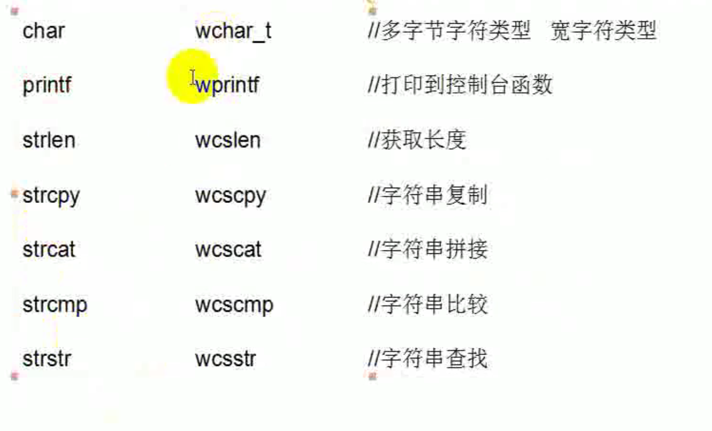

[TOC]

## 01_Win32课程介绍

## 02_字符编码

- ASCII
- GB2313或GB2312-80
- UNICODE：编码范围：0-0x10FFFF，可容纳100多万个符号
- Unicode的问题：Unicode只是一个符号集，他只规定了符号的而兼职代码，没有规定这个二进制代码该如何存储。
- 那么如何存储Unicode？UTF-16、UTF-8
  - UTF-16：
    - 以16位无符号整数位单位，不表示一个字符只有16位。
  - UTF-8

## 03_C语言中的宽字符


```
char szStr[] = "中国";//ascii
wchar_t swzStr[] = L"中国";//uniclde
```



## 04_Win32 API中的宽字符

- 什么是win32 API？有哪些？在哪里？
  - 主要放在c:\windows\system32
  - 几个重要的dll：
    - kernel32.dll：最核心的功能模块，比如内存管理。进程和线程相关的函数等。
    - User32.dll：是Windows用户界面相关应用程序接口，如创建窗口和发送消息等。
    - GDI32.dll：全程：Graphical Device Interface(图形设备接口)，包含用于画图和显示文本的函数。

```
TCHAR strBuff[] = TEXT("中国"); 
// TCHAR 根据当前项目的编码自动选择char还是wchar_t，
在Win32中推 荐使用这种方式
```

## 05_进程的创建过程

- 什么是进程？进程**提供**程序所需的资源，如数据、代码等。(使用是线程来做)

- 进程内存空间的地址划分：

  |     分区     |     x86 32位Windows     |
  | :----------: | :---------------------: |
  | 空指针赋值区 | 0x00000000 - 0x0000FFFF |
  |  用户模式区  | 0x00010000 - 0x7FFEFFFF |
  |  64KB禁入区  | 0x7FFF0000 - 0x7FFFFFFF |
  |     内核     | 0x80000000 - 0xFFFFFFFF |

- 进程的创建：

  - 使用函数：CreateProcess()
  - 进程的创建过程：
    1. 映射exe文件
    2. 创建内核对象EPROCESS
    3. 映射系统DLL
    4. 创建线程内核对象ETHREAD
    5. 系统启动线程
       - 映射DLL
       - 线程开 始执行

## 06_创建进程

```C++
CreateProcessW(
     LPCWSTR lpApplicationName,//进程名
     LPWSTR lpCommandLine,//命令行
     LPSECURITY_ATTRIBUTES lpProcessAttributes,//如果该参数为空（NULL），那么句柄不能被继承。
     LPSECURITY_ATTRIBUTES lpThreadAttributes,//这个参数决定的是线程是否被继承.
     BOOL bInheritHandles,//指示新进程是否从调用进程处继承了句柄。
     DWORD dwCreationFlags,//指定附加的、用来控制优先类和进程的创建的标志
     LPVOID lpEnvironment,//指向一个新进程的环境块
     LPCWSTR lpCurrentDirectory,//指向一个以NULL结尾的字符串，这个字符串用来指定子进程的工作路径
     LPSTARTUPINFOW lpStartupInfo,//指向一个用于决定新进程的主窗体如何显示的结构体
     LPPROCESS_INFORMATION lpProcessInformation
    );
```

结构体**LPPROCESS_INFORMATION lpProcessInformation**，这个结构体会有进程和线程的ID、句柄信息。

## 07_句柄表

- 什么是内核对象？

  像进程、线程、文件、互斥体、事件等在内核都有一个对应的结构体，这些结构体由内核负责管理，管这样的对象叫内核对象。

- 如何管理内核对象？

  每个进程都有一个句柄表。（process）

-   句柄本质上就一个防火墙，将应用层、内核层隔离开来，通过句柄就可以控制进程内核结构体，我们得到所谓 句柄的值实际上就是句柄表里的一个索引。

  

## 08_进程相关API

```
TerminateProcess();
OpenProcess();
ResumeThread();
```


## 09_创建线程

- 什么是线程？
  1. 线程是附属在进程上的执行实体，是代码的执行流程

  2. 一个进程可以包含多个线程，但一个进程至少要包含一个线程。

      一个进程可以包含多个线程（进程是空间上的概念，线程是时间上的概念）

```
    HANDLE CreateThread(                          // 返回值是线程句柄
        LPSECURITY_ATTRIBUTES lpThreadAttributes, // SD 安全属性，包含安全描述符（填NULL就可以）
        SIZE_T dwStackSize,                       // initial stack size 初始堆栈
        LPTHREAD_START_ROUTINE lpStartAddress,    // thread function 线程执行的函数代码
        LPVOID lpParameter,                       // thread argument 线程需要的参数
        DWORD dwCreationFlags,                    // creation option 标识，也可以以挂起形式创建线程
        LPDWORD lpThreadId                        // thread identifier 返回当前线程ID
    );
```


## 10_线程控制

```c
Sleep():Sleep函数是让当前执行到本函数时延迟指定的毫秒之后再向下走
SuspendThread()函数:用于暂停（挂起）某个线程
ResumeThread()函数:数用于恢复被暂停（挂起）的线程
```


```c++
   介绍三个函数：
    WaitForSingleObject，WaitForMultipleObjects，GetExitCodeThread
    ////////////////////////////////////////////////////////////////////
    1.WaitForSingleObject函数
    DWORD WaitForSingleObject(
        HANDLE hHandle,      // handle to object 句柄
        DWORD dwMilliseconds // time-out interval 等待超时时间（毫秒）
        如果你想一直等待的话，可以将第二参数的值设置为INFINITE。
    );
    
    HANDLE hThread;
    hThread = CreateThread(NULL, 0, ThreadProc, NULL, 0, NULL);
    WaitForSingleObject(hThread, INFINITE);
    printf("OK\n");
    CloseHandle(hThread);
    /////////////////////////////////////////////////////////////////////
    2.WaitForMultipleObjects函数：它可以等待多个内核对象的状态发生变更
    DWORD WaitForMultipleObjects(
        DWORD nCount,             // number of handles in array 内核对象的数量
        CONST HANDLE * lpHandles, // object-handle array 内核对象的句柄数组
        BOOL bWaitAll,            // wait option 等待模式
        DWORD dwMilliseconds      // time-out interval 等待超时时间（毫秒）
    );
    HANDLE hThread[2];
    hThread[0] = CreateThread(NULL, 0, ThreadProc, NULL, 0, NULL);
    hThread[1] = CreateThread(NULL, 0, ThreadProc, NULL, 0, NULL);
    WaitForMultipleObjects(2, hThread, TRUE, INFINITE);
    printf("OK\n");
    CloseHandle(hThread[0]);
    CloseHandle(hThread[1]);
    /////////////////////////////////////////////////////////////////////
    3.GetExitCodeThread函数
    线程函数会有一个返回值（DWORD），这个返回值可以根据你的需求进行返回，而我们需要如何获取这个返
    回结果呢？这时候就可以使用GetExitCodeThread函数 return 0;
    BOOL GetExitCodeThread(
        HANDLE hThread,    // handle to the thread
        LPDWORD lpExitCode // termination status
    );
    HANDLE hThread[2];
    DWORD dwresult1, dwresult2;
    hThread[0] = CreateThread(NULL, 0, ThreadProc, NULL, 0, NULL);
    hThread[1] = CreateThread(NULL, 0, ThreadProc1, NULL, 0, NULL);
    WaitForMultipleObjects(2, hThread, TRUE, INFINITE);
    GetExitCodeThread(hThread[0], &dwresult1);
    GetExitCodeThread(hThread[1], &dwresult2);
    printf("1:%d\n2:%d\nOK\n", dwresult1, dwresult2);
    CloseHandle(hThread[0]);
    CloseHandle(hThread[1]);
```

```c++
    // GetThreadContext函数， SetThreadContext函数
    // 1.GetThreadContext函数用于获取线程上下文
    // BOOL GetThreadContext(
    //     HANDLE hThread,     // handle to thread with context 句柄
    //     LPCONTEXT lpContext // context structure 结构体
    // );
    //2.SetThreadContext函数：个设置修改线程上下文，可以先设置然后再获取
    // BOOL SetThreadContext(
    //     HANDLE hThread,           // handle to thread
    //     CONST CONTEXT * lpContext // context structure
    // );
```


# 11.临界区

每个线程都有自己的栈，局部变量是存储在栈中的，这就意味着每个进程都会有一份自己的“句柄变 量”（栈），如果线程仅仅使用自己的“局部变量”那就不存在线程安全问题，反之，如果多个线程共用一个全 局变量呢？那么在什么情况下会有问题呢？那就是当多线程共用一个全局变量并对其进行修改时则存在安全问 题，如果仅仅是读的话没有问题。 如下所示代码，我们写了一个线程函数，该函数的作用就是使用全局变量，模拟的功能就是售卖物品，全局变 量countNumber表示该物品的总是，其值是10，而如果有多个地方（线程）去卖（使用）这个物品（全局变 量），则会出现差错


