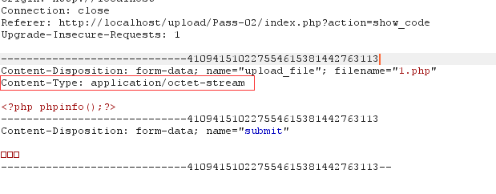
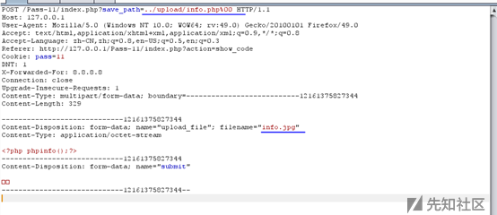

# 文件上传之后端黑白名单绕过


文件上传常见验证：

-   后缀名：黑白名单
-   文件类型：MIME信息
-   文件头：内容头信息

黑名单：

-   .htaccess解析
-   大小写绕过
-   点绕过
-   空格绕过
-   ::\$DATA绕过
-   配合解析漏洞
-   双后缀名绕过

白名单

-   MIME
-   %00截断（地址）
-   0x00截断（文件名）
-   0x0a截断


### Load labs less-1

就是个前端校验，改后就OK

### Load labs Less-2（MIME）



读源码发现只判断content-type，改掉就OK

### Load labs Less-3

黑名单

```php
$is_upload = false;
$msg = null;
if (isset($_POST['submit'])) {
    if (file_exists(UPLOAD_PATH)) {
        $deny_ext = array('.asp','.aspx','.php','.jsp');
        $file_name = trim($_FILES['upload_file']['name']);//去除字符
        $file_name = deldot($file_name);//删除文件名末尾的点
        $file_ext = strrchr($file_name, '.');
        $file_ext = strtolower($file_ext); //转换为小写
        $file_ext = str_ireplace('::$DATA', '', $file_ext);//去除字符串::$DATA
        $file_ext = trim($file_ext); //收尾去空

        if(!in_array($file_ext, $deny_ext)) {
            $temp_file = $_FILES['upload_file']['tmp_name'];
            $img_path = UPLOAD_PATH.'/'.date("YmdHis").rand(1000,9999).$file_ext;            
            if (move_uploaded_file($temp_file,$img_path)) {
                 $is_upload = true;
            } else {
                $msg = '上传出错！';
            }
        } else {
            $msg = '不允许上传.asp,.aspx,.php,.jsp后缀文件！';
        }
    } else {
        $msg = UPLOAD_PATH . '文件夹不存在,请手工创建！';
    }
}

```

可以使用php3，php5，phtml后缀绕过。


### Load labs less-4

.htaccess文件上传漏洞

写一个.htaccess文件然后上传：

```
<FilesMatch "shell">
  SetHandler application/x-httpd-php
</FilesMatch>
```

之后上传一个shell的jpg就OK，htaccess将以shell为名的文件作为php来解析，不管后缀名

### Load labs less-5

这一关在第四关的基础上加上了htaccess， 但是并没有大小写，所以...

### Load labs less-7

少了收尾去空`trim($file_ext);`

所以在文件后加上空格后绕过了检查

### Load labs less-8

少了 `$file_name = deldot($file_name);//删除文件名末尾的点`

在文件的后缀加"."绕过就OK

### Load labs less-9

少了`$file_ext = str_ireplace('::$DATA', '', $file_ext);//去除字符串::$DATA`

php+win下，会将文件名+"::\$DATA之后的数据当成文件流处理,不会检测后缀名.且保持"::$DATA"之前的文件名。

所以这关抓包后加::\$DATA 即可

### Load labs less-10

这里的代码只循环了一次，也就是说删除文件末尾的点和去除收尾空格只执行了一次，那么：

上传：1.php. .就可绕过

### Load labs less-11

同样也只写了一次，那么抓包修改为1.pphphp即可。

### Load labs less-12

白名单，但是上传路径可控，那么可以%00截断



### Load labs less-13

和上一题一样，只不过是post，post要编码


