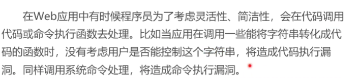
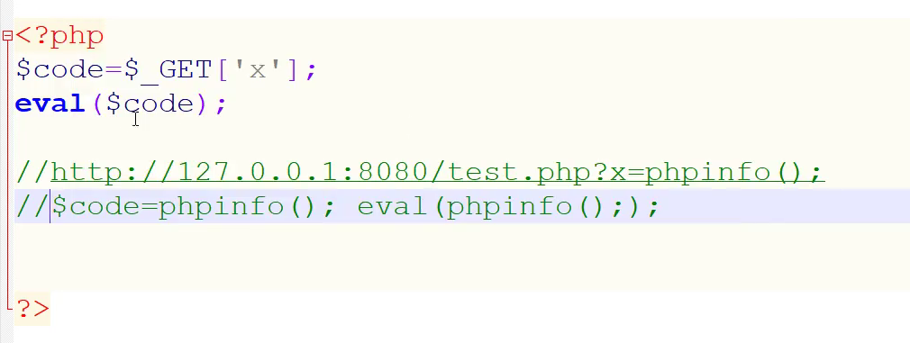

# RCE代码及命令执行漏洞

代码执行：

-----------

## 漏洞形成条件：

>   可控变量，漏洞函数

-----------

## 检测：

-   白盒：代码审计
-   黑盒：
    -   扫描工具
    -   公开漏洞
    -   手工看参数

--------------------

## 产生：

-   web源码：
-   中间件
-   其他环境

--------

# （完）

