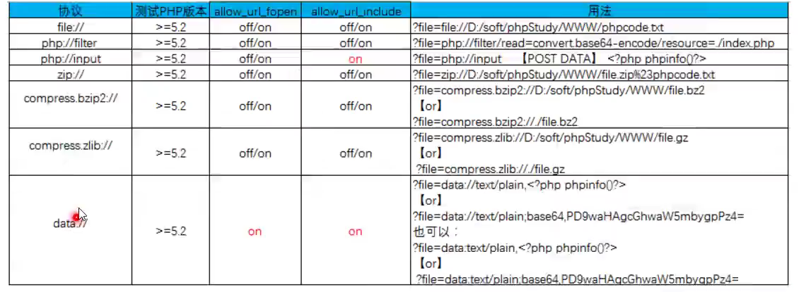

# 2文件包含漏洞

本地包含，远程包含

-----

## 本地包含 -无限制，有限制

%00截断：

​	条件：`magic_quotes_gpc = Off`，PHP版本<5.3.4

长度截断：

​	条件：Windows，点号需要长于256，linux长于4096.

-------

## 远程包含-无限制，有限制

配置： `allow_url_include`

>   ?filename=www..........

有限制的话可以加%20,%23等

-------

## 伪协议

