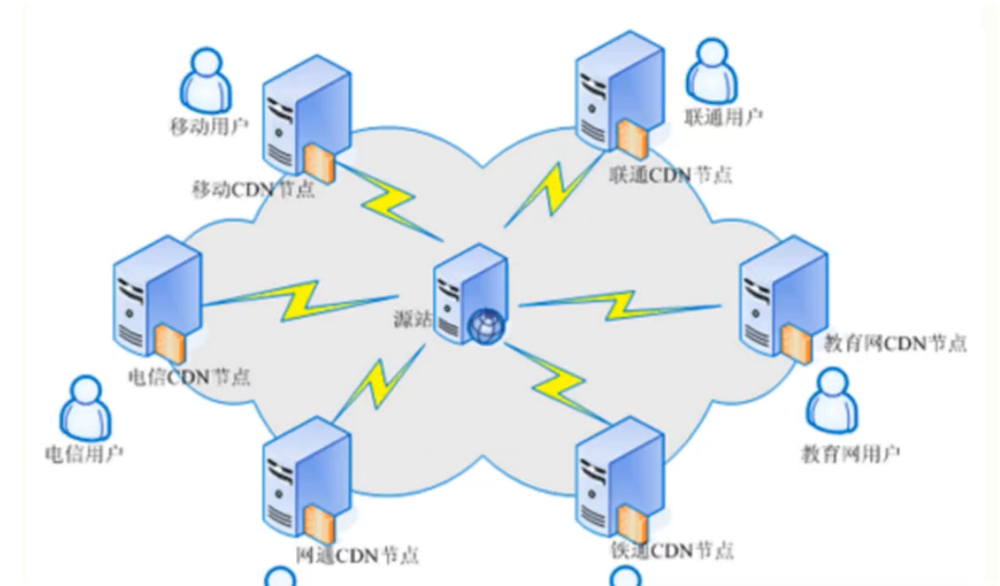

# 信息收集-CDN绕过技术




-    如何判断目标存在CDN服务？
    -   利用多借点技术进行请求返回判断
    -   百度“超级ping”
-     CDN堆安全测试的影响：
-   目前常见的CDN绕过技术：
    -   子域名查询
    -   邮件服务查询
    -   国外地址请求
    -   遗留文件，扫描全网
    -   黑暗引擎搜索特定文件
    -   dns历史记录，以量打量（DDoS）


## 涉及资源:

```
https://www.shodan.io
https://x.threatbook.cn
http://ping.chinaz.com
https://www.get-site-ip.com/
https://asm.ca.com/en/ping.php
https://github.com/boy-hack/w8fuckcdn
https://mp.weixin.qq.com/s?biz=MzA5MzQ3MDE1NQ==&mid=2653939118&idx=1&sn=945b81344d9c89431a8c413ff633fc3a&chksm=8b86290abcf1a01cdc00711339884602b5bb474111d3aff2d465182702715087e22c852c158f&token=268417143&lang=zhCN#rd
```

