[TOC]


# day01

## 域名

## DNS

-   域名和IP的相互转换

-   hosts与DNS关系
-   CDN

## 脚本语言

## 后门

## WEB

## WEB相关安全漏洞

# day02

## Request请求数据包格式

`Request请求数据包格式：`

1.  请求行：请求类型/请求资源路径、协议的版本和类型
2.  请求头：一些键值对，浏览器与web服务器之间都可以发送，特定的某种含义
3.  空行：请求头与请求体之间用一个空行隔开
4.  请求体：要发送的数据

例：

```
GET / HTTP/1.1
Host: www.baidu.com
Connection: keep-alive
Cache-Control: max-age=0
sec-ch-ua: "Google Chrome";v="89", "Chromium";v="89", ";Not A Brand";v="99"
sec-ch-ua-mobile: ?0
Upgrade-Insecure-Requests: 1
User-Agent: Mozilla/5.0 (Windows NT 10.0; Win64; x64) AppleWebKit/537.36 (KHTML, like Gecko) Chrome/89.0.4389.82 Safari/537.36
Accept: text/html,application/xhtml+xml,application/xml;q=0.9,image/avif,image/webp,image/apng,*/*;q=0.8,application/signed-exchange;v=b3;q=0.9
Sec-Fetch-Site: same-site
Sec-Fetch-Mode: navigate
Sec-Fetch-User: ?1
Sec-Fetch-Dest: document
Referer: https://passport.baidu.com/
Accept-Encoding: gzip, deflate, br
Accept-Language: zh-CN,zh;q=0.9,zh-HK;q=0.8,zh-TW;q=0.7
Cookie:
```

```
User-Agent: 是客户浏览器的名称
Connection: 从来告诉服务器是否可以维持固定的HTTP链接
Cookie: 浏览器用这个属性向服务器发送cookie
Referer: 表明产生请求的晚网页URL。这个属性可以用来跟踪web请求是从什么网站来的。
```

## Response返回数据包数据格式

一个响应有4个部分组成

1.  状态行：协议版本、数字形式的状态码和状态描述，各元素之间以空格分隔
2.  响应头标：包含服务器类型、日期、长度、内容类型等
3.  空行：响应头与响应体之间用空行隔开
4.  响应数据：浏览器会将实体内容中的数据取出来，生成相应的页面

```
HTTP响应码：
1xx：信息，请求收到，继续处理
2xx：成功，行为被成功地接收、理解和采纳
3xx：重定向，为了完成请求，必须进一步执行的动作
4xx：客户端错误
5xx：服务器错误
```

举例：

```
HTTP/1.1 200 OK
Bdpagetype: 1
Bdqid: 0xc476938f000163f7
Cache-Control: private
Connection: keep-alive
Content-Encoding: gzip
Content-Type: text/html;charset=utf-8
Date: Sat, 27 Mar 2021 09:15:58 GMT
Expires: Sat, 27 Mar 2021 09:15:33 GMT
Server: BWS/1.1
Set-Cookie: BDSVRTM=0; path=/
Set-Cookie: BD_HOME=1; path=/
Set-Cookie: H_PS_PSSID=33764_33745_33273_31253_33692_33758_33392_33714_26350; path=/; domain=.baidu.com
Strict-Transport-Security: max-age=172800
Traceid: 1616836558056844647414156664721075430391
X-Ua-Compatible: IE=Edge,chrome=1
Transfer-Encoding: chunked
```

-----------


# day03


## 搭建安全扩展

涉及知识：

-   常见搭建平台脚本启用
-   域名IP目录解析安全问题
-   常见文件后缀解析对用安全
-   常见安全测设中的安全防护 
-   web后门与用户及文件权限


`win server 2003 与 IIS安装`

注意IP访问与域名访问结果可能不同，目录的不同。

# day04

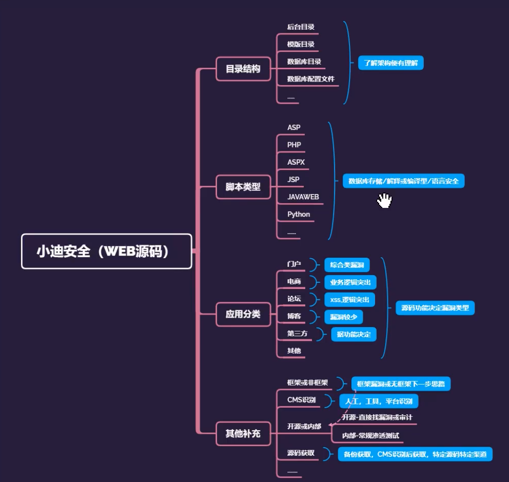

CMS指纹识别

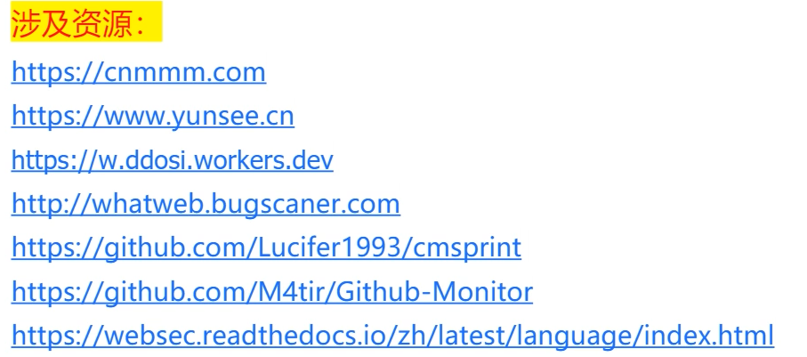

# day05

## 系统及数据库等

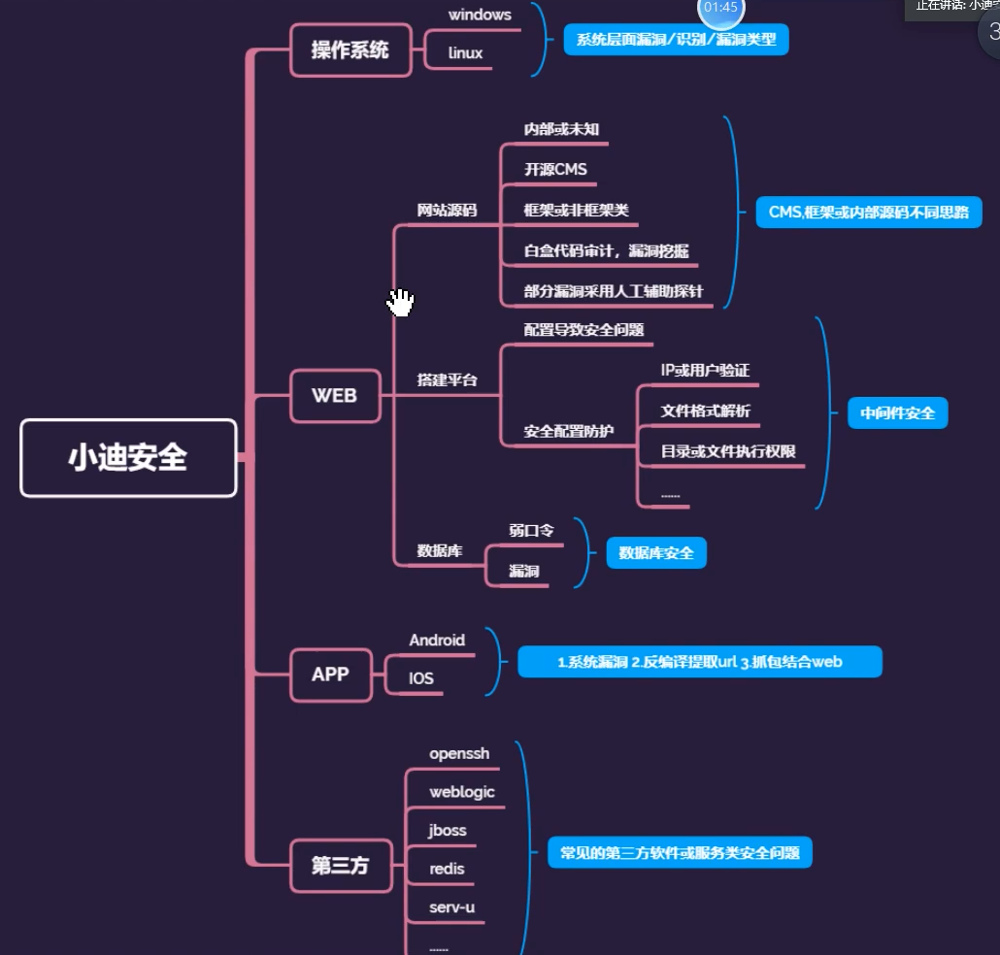

-   Windows做服务器一些大小写不敏感
-   Linux敏感

使用nmap探测

# day06

## 加解密算法

没啥写的

# day07

## 信息收集-CDN绕过技术


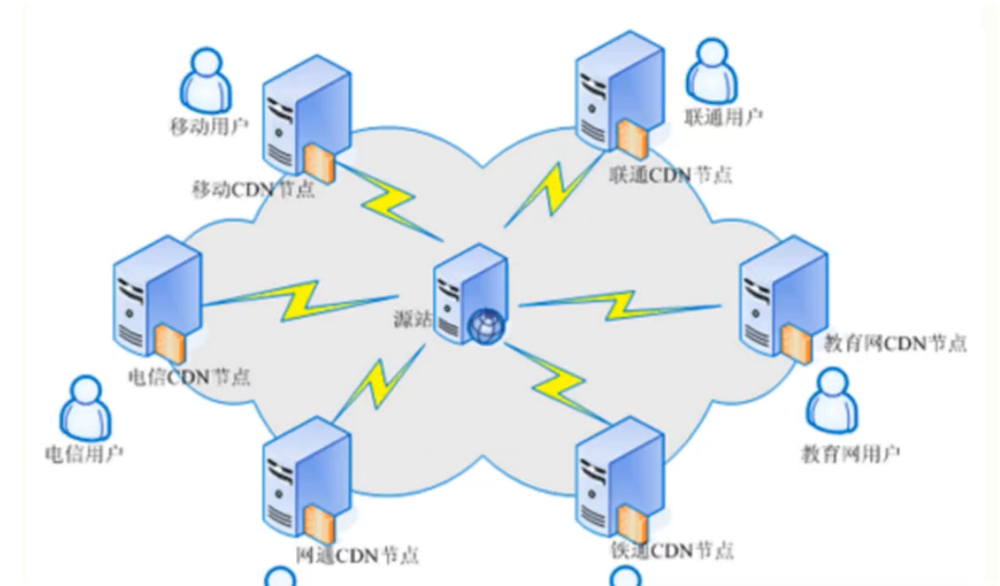

-    如何判断目标存在CDN服务？
     -   利用多借点技术进行请求返回判断
     -   百度“超级ping”
-    CDN堆安全测试的影响：
-    目前常见的CDN绕过技术：
     -   子域名查询
     -   邮件服务查询
     -   国外地址请求
     -   遗留文件，扫描全网
     -   黑暗引擎搜索特定文件
     -   dns历史记录，以量打量（DDoS）

## 涉及资源:

```
https://www.shodan.io
https://x.threatbook.cn
http://ping.chinaz.com
https://www.get-site-ip.com/
https://asm.ca.com/en/ping.php
https://github.com/boy-hack/w8fuckcdn
https://mp.weixin.qq.com/s?biz=MzA5MzQ3MDE1NQ==&mid=2653939118&idx=1&sn=945b81344d9c89431a8c413ff633fc3a&chksm=8b86290abcf1a01cdc00711339884602b5bb474111d3aff2d465182702715087e22c852c158f&token=268417143&lang=zhCN#rd
```

# day08

## 信息收集-架构，搭建，WAF等

站点搭建分析：

-   搭建习惯--目录型站点

    比如`xxx.com`  和`xxx.com/bbs`，两个界面明显不同，两个程序

-   搭建习惯--端口类站点

    就比如说一个域名的80与8080是两个站点

-   搭建习惯--子域名站点

-   搭建习惯--类似域名站点

-   搭建习惯--旁注，c段站点

    旁注：同服务器不同站点

    C段：不同服务器不同站点，在同一网段

-   搭建习惯--搭建软件特征站点

    就是是否用了集成的软件，比如wamp等，还是各自独立安装的。

WAF：

-   WAFW00F：https://github.com/EnableSecurity/wafw00f

    判断哪种目标站点是waf

# day09

没啥写的

# day10

## 信息收集--资产监控扩展


1.  全球节点请求CDN

2.  黑暗引擎相关搜索

    fofa，shodan，zoomeye

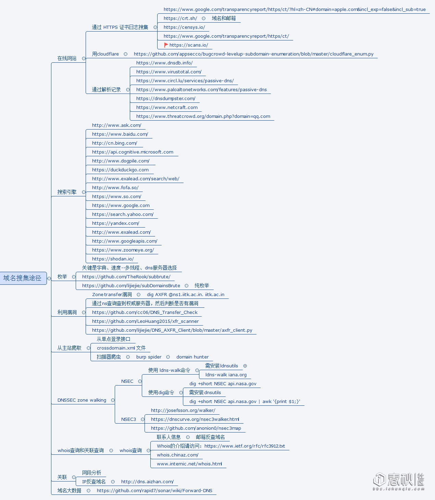


也没啥想写的。。。

## 涉及资源:

https://crt.sh
https://dnsdb.io
http://sc.ftqq.com/3.version
https://tools.ipip.net/cdn.php
https://github.com/bit4woo/teemo
https://securitytrails.com/domain/www.baidu.com/history/a


# day11

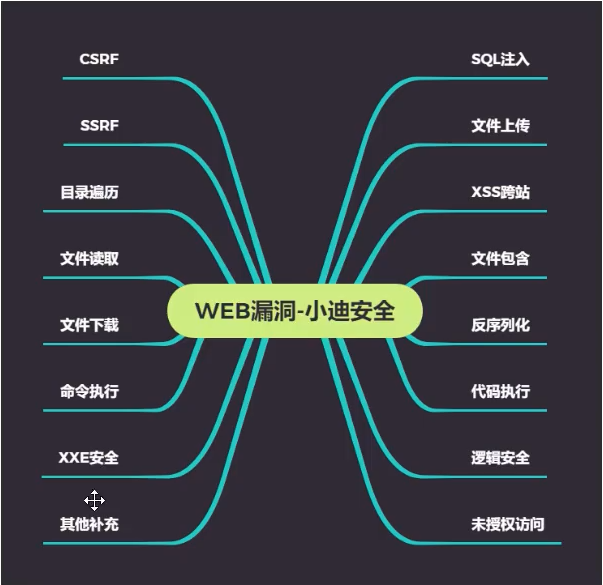

**涉及资源**：一个小靶场

```
https://github.com/zhuifengshaonianhanlu/pikachu
```


# day12


## WEB漏洞--SQL注入之简要SQL注入

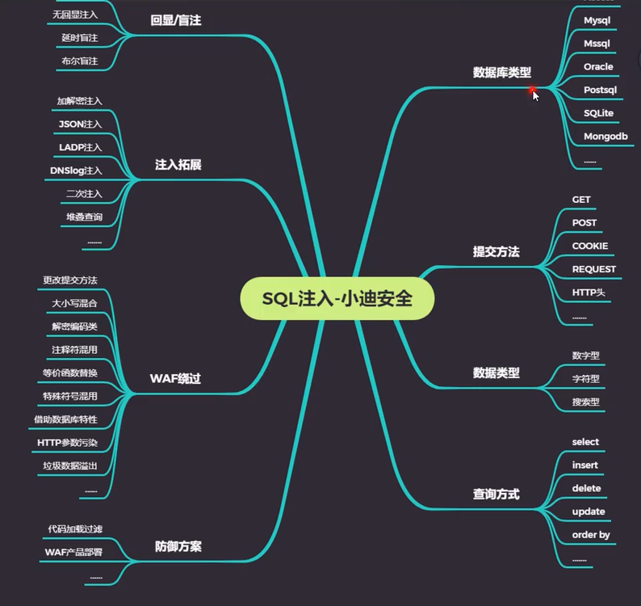


## MySQL注入

### 信息收集

-   操作系统
-   数据库名
-   数据库用户
-   数据库版本
-   网站路径等

### 数据注入

-   低版本：暴力查询或结合读取查询

-   高版本：information_schema有据查询 

-   MySQL5.0以上版本存在自带数据库，information_schema，他是一个存储记录所有数据库名，表名，列名的数据库也相当于可以通过查询他获取指定数据库下面的表名或列名信息。

-   数据库中符号"."表示下一级，比如xiaodi.user表示xiaodi数据库下user的表名

    information_schema.tables：

    information_schema.column：记录所有列名的表

    table_schema：数据库名


------

### 数据库结构

```
MySQL数据库
	数据库A == 网站A
		表名(tables)
			列名
				数据
	数据库B == 网站B
	。。。
	数据库B == 网站B
```

```
use databases_name;
show tables;
select * from 表名; 
```


1.  如何判断是否有注入点：

```
老方法：
	and 1=1 返回正常
	and 1=2 返回错误
	可能存在注入点
或
	乱输入后 ，网站有影响，说明拼接的内容进入了数据库查询
还有一种：
	404 跳转，一般没问题
```

2.  猜解列名数量（字段数） order by，猜到错误与正常 的正常值

    `xxx.com/?id=1 order by 4`

3.   报错猜解

     `?id = -1 union select 1,2,3,4`

     假设显示2，3

4.  信息收集

    数据库版本：version()	：ubuntu

    数据库名字：database()	：mozhe_dis

    数据库用户：user()	：root@localhost

    操作系统：@@version_compile_os	：linux

    `?id = -1 union select 1,version(),database(),4`

    `?id = -1 union select 1,user(),@@version_compile_os,4`

    

5.  查询指定数据库名mozhe_dis下的表名信息：

    `?id=-1 union select 1,table_name,3,4 from information_schema.tables where table_schema = 'mozhe_dis'`

    上面只显示一个，如果想显示所有表名：group_concat()

    `?id=-1 union select 1,group_concat(table_name),3,4 from information_schema.tables where table_schema = 'mozhe_dis'`

    

    假设查到表名：storm_mem

6.  查询指定表名storm_mem下的列信息：

     `?id=-1 union select 1,group_concat(column_name),3,4 from information_schema.column where table_name = 'storm_mem'`

    假设查到passwd,id

7.  查询指定数据

    `?id=-1 union select 1,passwd,id,4 from storm_mem`

# day13


## SQL注入之MySQL注入


除上节的信息收集外：

MySQL注入：

-   高权限注入
    -   常规查询
    -   跨库查询
    -   文件读写
        -   存在魔术引号：编码或宽字节绕过
        -   不存在魔术引号
-   相关防注入
    -   自带防御：魔术引号
    -   内置函数：int等
    -   自定义关键字：select
    -   WAF防护软件：安全狗，宝塔等。

------

## 高权限注入及低权限注入

### 跨库查询及相应思路

​	information_schema表特征，记录库名，表名列名对应表

1.  获取所有数据库名

    `id=-1 union select 1,group_concat(schema_name),3, from informaton_schema.schema`

    假设得到数据库ssqq

2.  获取指定ssqq数据库下表名信息

    `id=-1 union select 1,group_concat(table_name),3, from informaton_schema.tables where table_schema='ssqq'`

    假设得到表admin

3.   获取ssqq数据库下表admin的段名信息

     `id=-1 union select 1,group_concat(column_name),3, from informaton_schema.column where table_name='admin'`

      因为admin比较常见，所以上述查询语句可能查询出其他数据库下的admin表，那么加一句：

     `id=-1 union select 1,group_concat(column_name),3, from informaton_schema.column where table_name='admin' and table_schema='ssqq'`

4.  获取数据

    `union select 1 u,p from ssqq.admin`


### 文件读写操作

load_file()：读取函数

into outfile或into dumpfile：写入函数

### 路径获取常见方法

报错显示，遗留文件，漏洞报错，平台报错文件，爆破等。

### 常见写入文件问题：魔术引号开关

`magic_quotes_gpc`

# day14

## 类型及提交注入

注入方法：

-     GET
-     POST
-     COOKIE
-     REQUEST（全部接受）
-     HTTP头
-     等

数据类型

-   数字型
-   字符型
-   搜索型

------

简要说明参数类型：

-   数字，字符，搜索，JSON等  

\$_SERVER：

------

演示案例：

1.  参数字符型注入测试=>sqllabs less 5 6
2.  POST数据提交注入测试=>sqllabs less 11
3.  参数JSON数据注入测试=>本地环境代码演示
4.  COOKIE数据提交注入测试=>sqllab less 20
5.  HTTP头部参数数据注入测试=>sqllab less 18


# day15

## Oracle，MongoDB等注入

简要学习各种数据库的注入特点

-   数据库架构组成，数据库高权限操作

简要学习各种注入工具的使用指南

-   熟悉工具的支持库，注入模式，优缺点

-   sqlmap，NoSQLAttack，pangolin等


数据库的不同

```
Access
	表 
		列
			数据
			
mssql等其他数据库
	数据库A
		表
			列
				数据
	数据库B	
		...
```

Access数据库的话没有`information_schema` ，所以只能靠猜。

MongoDB的查询文档的方式与其他数据库略微不同，当进行查询的时候，MySQL是用where，而MongoDB是以键值对形式进行查询的。


遗留问题：

-   Access猜不到表和列怎么办？

    Access偏移注入

# day16

## SQL注入之查询方式及报错盲注

当进行SQL注入时，有很多注入会出现无回显的情况，其中不回显的.原因可能是SQL语句查询方式的问题导致，这个时候我们需要用到相关的报错或盲注进行后续操作，同时作为手工注入时，提前了解或预知其SQL语句大概写法也能更好的选择对应的注入语句。


-   select注入

-   insert注入

    `insert into member(username,pw,sex,email,.....) value('xiaodi',md5('12345'),'man','12312313'...)`

    只有成功还是未成功

    

-   update注入

    

-   delete注入


盲注分类

-   基于布尔的SQL盲注--逻辑判断

    regexp，like，ascii，left，ord，mid

-   基于时间 的失去了盲注--延时判断

    if，sleep

-   基于报错的SQL盲注--报错回显

    floor，updatexml，extractvalue

```
参考:
like 'r%'						#判断xo或ro.. .是否成立
regexp '^xiaodi [a-z]' 			#匹配xiaodi及xiaodi...等
if (条件,5,0)					   #条件成立返回5反之返回0
sleep (5)						#sQI语句延时执行5秒
mid(a,b,c)						#从位置b开始，截取a字符串的c位
substr(a,b, c)					#从b位置开始，截取字符串a的c长度
left (database(),1)，database() #left (a, b)从左侧截取a的前b位
length (database ())=8			#判断数据库 database ()名的长度
ord=ascii ascii (x)=97			#判断x的ascii码是否等于97
```


# day17

## SQL二次注入，加解密，DNS等注入

sql-lab less-21 加解密注入

sql-lab less-24 二次注入：全是白盒测试得到


DNSlog注入（高权限）：解决了盲注不能回显数据，效率低的问题

http://ceye.io


# day18

## 堆叠注入及WAF绕过注入

18和19都是绕waf，没写没看。

直接开始day20往后的， 文件上传的部分

# day10

## 文件上传基础

# day21

## 文件上传之后端黑白名单绕过


文件上传常见验证：

-   后缀名：黑白名单
-   文件类型：MIME信息
-   文件头：内容头信息

黑名单：

-   .htaccess解析
-   大小写绕过
-   点绕过
-   空格绕过
-   ::\$DATA绕过
-   配合解析漏洞
-   双后缀名绕过

白名单

-   MIME
-   %00截断（地址）
-   0x00截断（文件名）
-   0x0a截断

---------


### Load labs less-1

就是个前端校验，改后就OK

### Load labs Less-2（MIME）

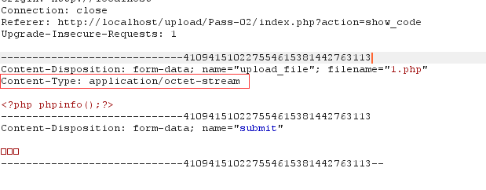

读源码发现只判断content-type，改掉就OK

### Load labs Less-3

黑名单

```php
$is_upload = false;
$msg = null;
if (isset($_POST['submit'])) {
    if (file_exists(UPLOAD_PATH)) {
        $deny_ext = array('.asp','.aspx','.php','.jsp');
        $file_name = trim($_FILES['upload_file']['name']);//去除字符
        $file_name = deldot($file_name);//删除文件名末尾的点
        $file_ext = strrchr($file_name, '.');
        $file_ext = strtolower($file_ext); //转换为小写
        $file_ext = str_ireplace('::$DATA', '', $file_ext);//去除字符串::$DATA
        $file_ext = trim($file_ext); //收尾去空

        if(!in_array($file_ext, $deny_ext)) {
            $temp_file = $_FILES['upload_file']['tmp_name'];
            $img_path = UPLOAD_PATH.'/'.date("YmdHis").rand(1000,9999).$file_ext;            
            if (move_uploaded_file($temp_file,$img_path)) {
                 $is_upload = true;
            } else {
                $msg = '上传出错！';
            }
        } else {
            $msg = '不允许上传.asp,.aspx,.php,.jsp后缀文件！';
        }
    } else {
        $msg = UPLOAD_PATH . '文件夹不存在,请手工创建！';
    }
}

```

可以使用php3，php5，phtml后缀绕过。


### Load labs less-4

.htaccess文件上传漏洞

写一个.htaccess文件然后上传：

```
<FilesMatch "shell">
  SetHandler application/x-httpd-php
</FilesMatch>
```

之后上传一个shell的jpg就OK，htaccess将以shell为名的文件作为php来解析，不管后缀名

### Load labs less-5

这一关在第四关的基础上加上了htaccess， 但是并没有大小写，所以...

### Load labs less-7

少了收尾去空`trim($file_ext);`

所以在文件后加上空格后绕过了检查

### Load labs less-8

少了 `$file_name = deldot($file_name);//删除文件名末尾的点`

在文件的后缀加"."绕过就OK

### Load labs less-9

少了`$file_ext = str_ireplace('::$DATA', '', $file_ext);//去除字符串::$DATA`

php+win下，会将文件名+"::\$DATA之后的数据当成文件流处理,不会检测后缀名.且保持"::$DATA"之前的文件名。

所以这关抓包后加::\$DATA 即可

### Load labs less-10

这里的代码只循环了一次，也就是说删除文件末尾的点和去除收尾空格只执行了一次，那么：

上传：1.php. .就可绕过

### Load labs less-11

同样也只写了一次，那么抓包修改为1.pphphp即可。

### Load labs less-12

白名单，但是上传路径可控，那么可以%00截断

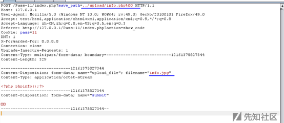

### Load labs less-13

和上一题一样，只不过是post，post要编码


# day22

## 文件上传之内容逻辑数组绕过

### Load labs less-14

`copy normal.jpg /b + shell.php /a webshell.jpg`

还需结合文件包含漏洞

?file=/asdfasf/xxx.jpg


后面的几关都是这样，只是函数不同


## 解析漏洞

**IIS6.0**

-   文件夹
    -   image/qq.jpg
    -   image/qq.jsp/qq.jpg
-   文件
    -   xxx.jsp;.xxx.jpg或xxx.jsp;.jpg

**Nginx**

-   

# day23 ~day24没看(记得后续看)

# day25

## xss跨站之原理分类及攻击手法

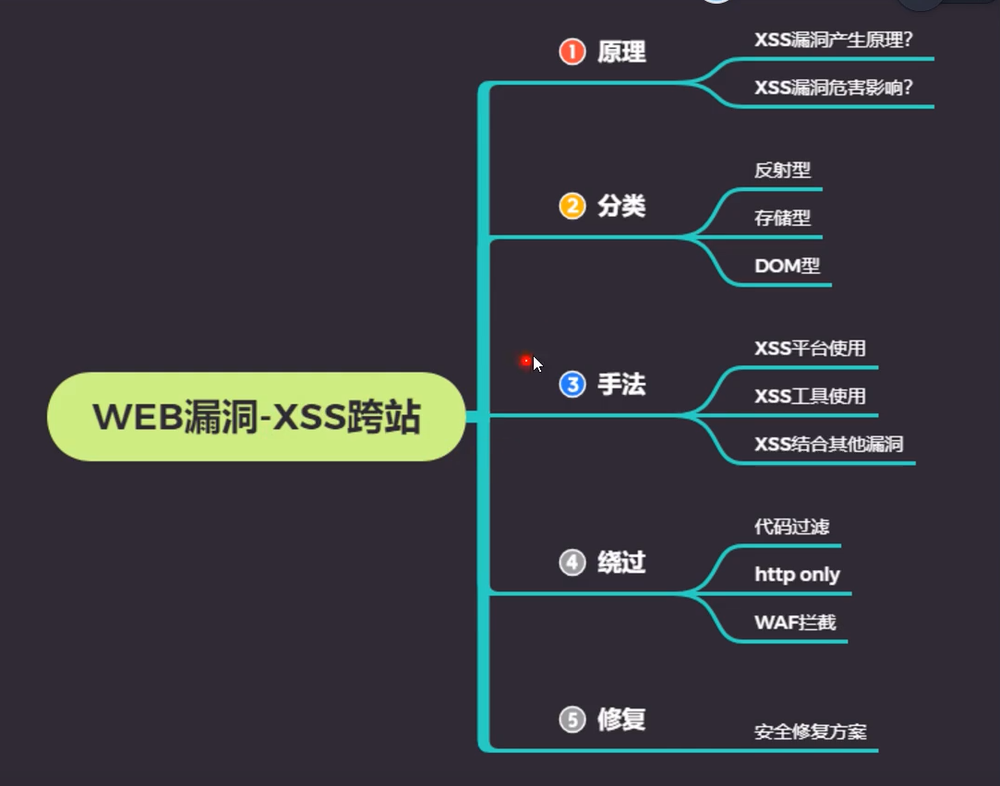

**分类**

-   反射
-   存储
-   DOM

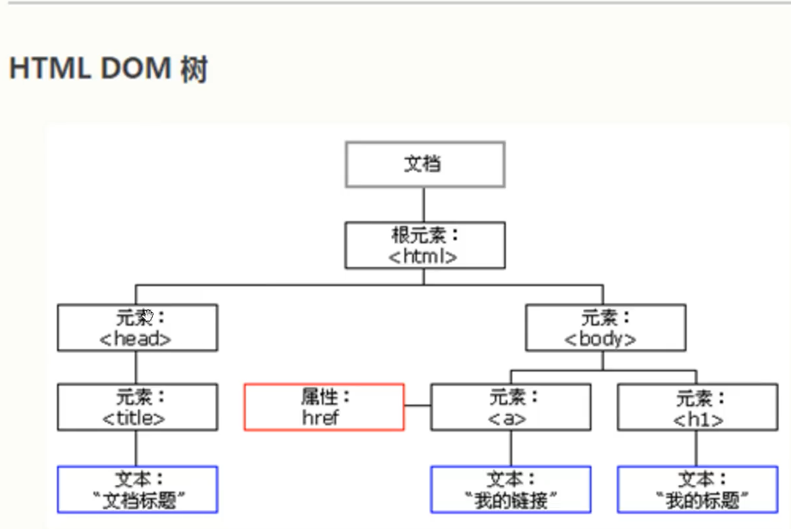


Cookie ：存储本地 ，存活时间较长，小中型

session ：存储服务器，存活时间较短，大型

# day26

## xss跨站之订单及shell箱子反杀记

# day27

## 代码及http only绕过

HTTP only：仅仅只是防止了获Cookie，并没有防止xss

# day27，28没看


# day29

CSRF

SSRF

# day30

## RCE代码及命令执行漏洞


代码执行：

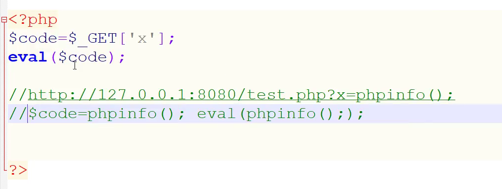

-----------

## 漏洞形成条件：

>   可控变量，漏洞函数

-----------

## 检测：

-   白盒：代码审计
-   黑盒：
    -   扫描工具
    -   公开漏洞
    -   手工看参数

--------------------

## 产生：

-   web源码：
-   中间件
-   其他环境


--------


# day31

文件包含漏洞

本地包含，远程包含

-----

## 本地包含 -无限制，有限制

%00截断：

​	条件：`magic_quotes_gpc = Off`，PHP版本<5.3.4

长度截断：

​	条件：Windows，点号需要长于256，linux长于4096.

-------

## 远程包含-无限制，有限制

配置： `allow_url_include`

>   ?filename=www..........

有限制的话可以加%20,%23等


-------

## 伪协议

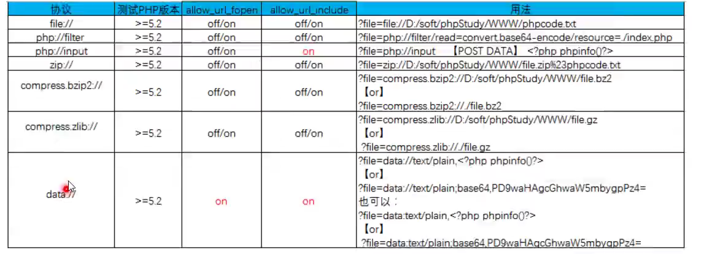


# day32

## 文件操作之文件下载读取

 文件下载可以下载配置文件等等或者下载系统的默认文件


emmm...没啥写的

# day33

## 逻辑越权之水平垂直越权

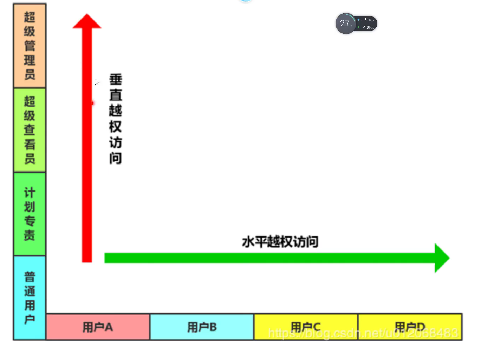

>   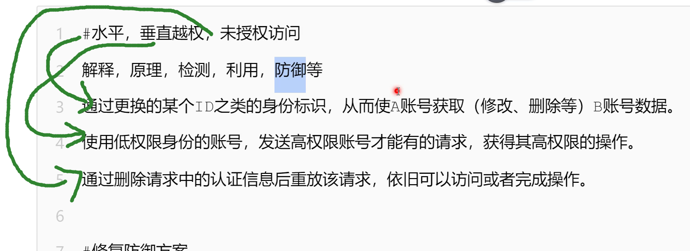


改session，cookie之类的可以水平、垂直越权之类的。

>   ==越权检测工具：==
>
>   ==github：secscan-authcheck==


# day34

逻辑越权之登陆脆弱及支付篡改

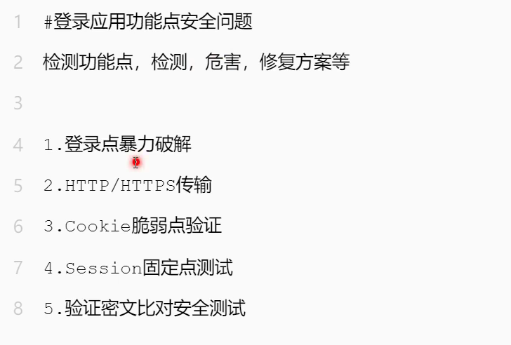


>   口令爆破字典：
>
>   github：password_brute_dictionary

burp爆破自带加密，选中就OK


数量：可以改-1等

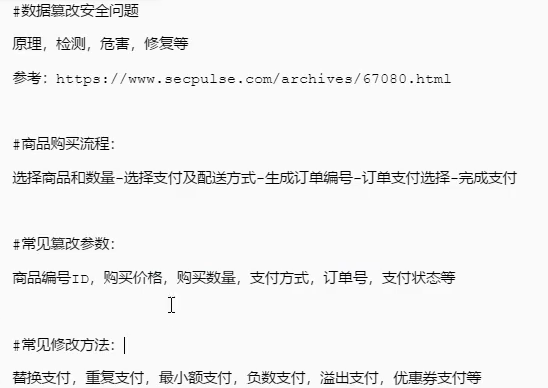


# day35

逻辑越权之找回机制及借口安全


客户端回显：

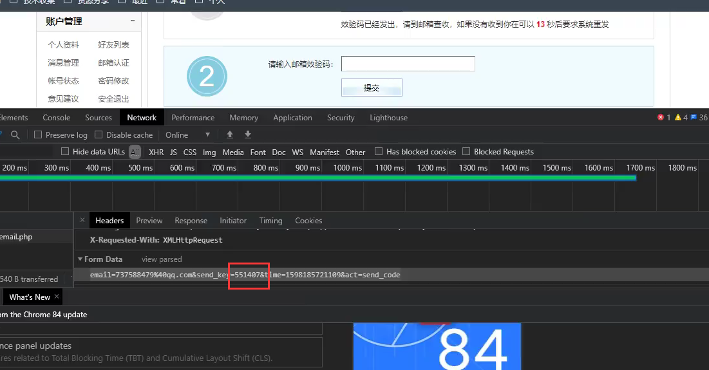


# day36

逻辑越权之验证码与Token及接口

看了22min，过。

# day37

反序列化之PHP&java全解

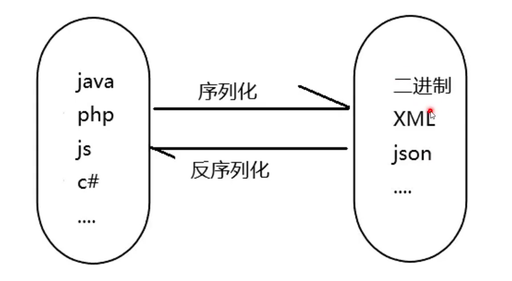

字符串与对象的转换。

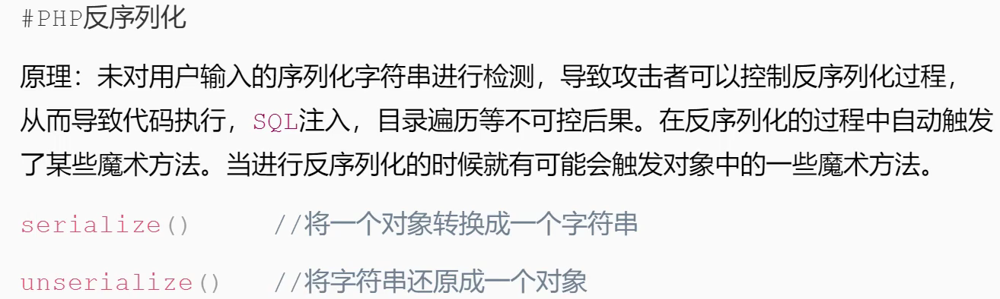


# day38

java反序列化

>   ==利用工具：ysoserial==（payload生成）

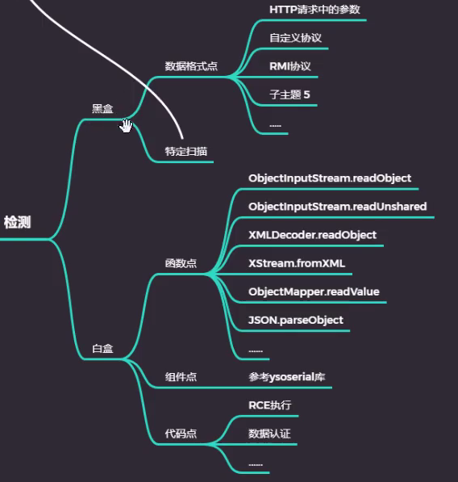


看的有点不太懂，跳了，下一集。

# day39（未完）

xxe&xml之利用检测绕过。

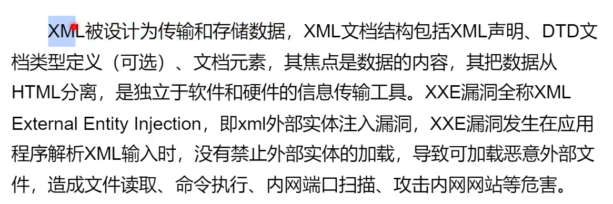


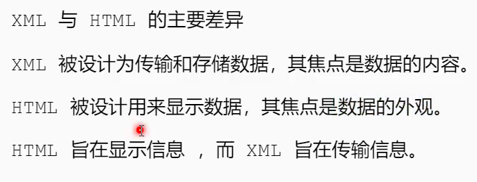


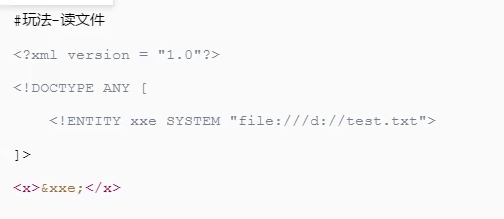


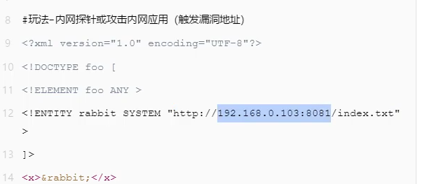


讲的不太全，不听了。。


# day40 41（未看）

# day42

漏洞发现-操作系统之漏洞探针类型利用修复

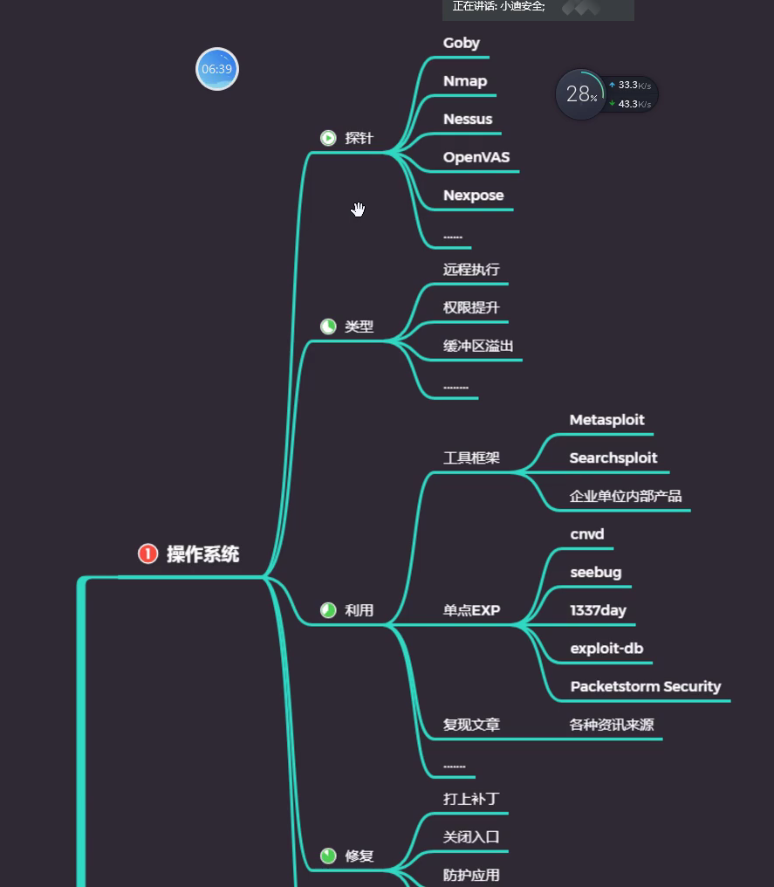

漏洞扫描工具：Goby,nmap,nessus  

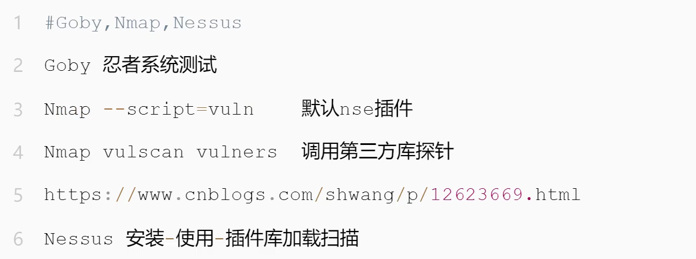

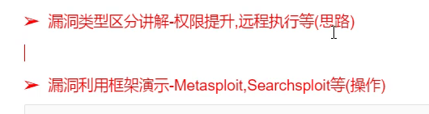

完

# day43

## 漏洞发现-WEB应用之漏洞探针类型利用修复

 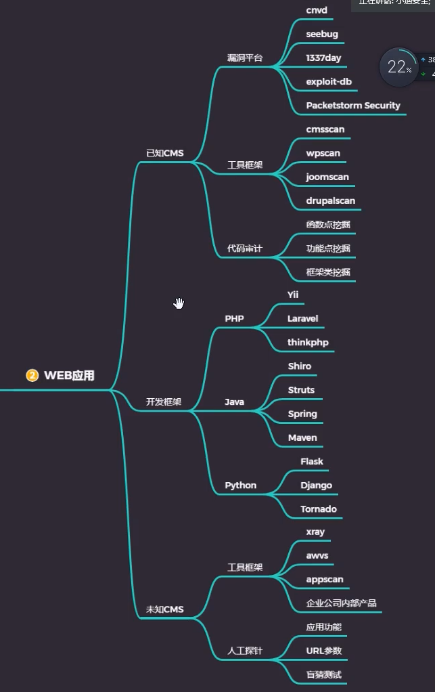

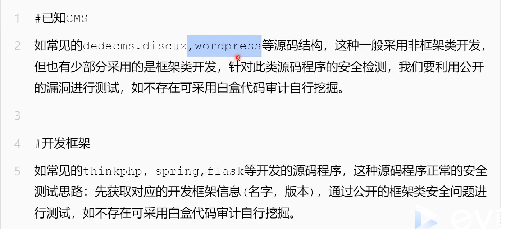


