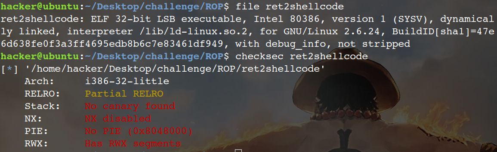
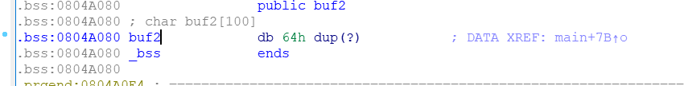
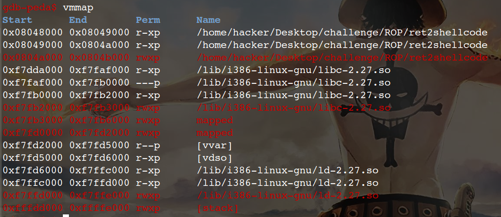
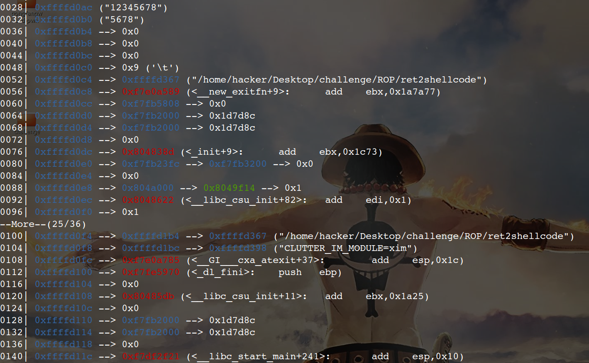
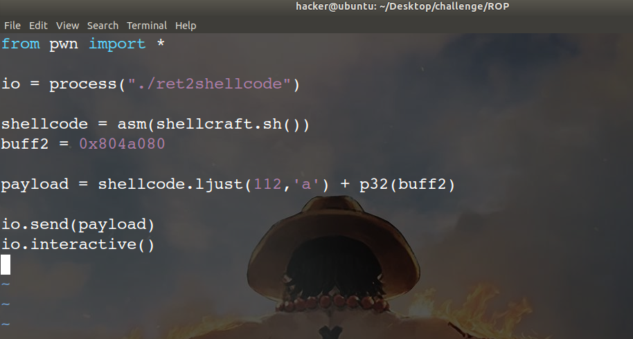
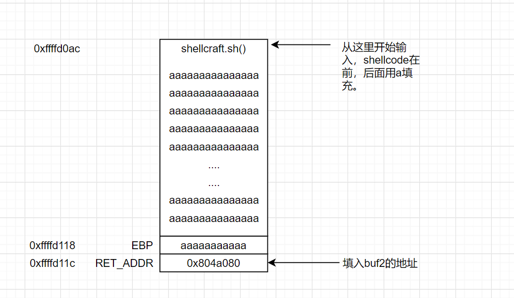

# ret2shellcode

首先file和checksec一下：

发现rwx并且没有开NX保护，所以代码在堆，栈上可以执行

进入IDA查看，发现这题并没有后门函数，将gets到的s拷贝到buf2.

查看buf2所在的bss段是否可执行

main处下断点后run起来，此时ebp=0xffffd118

exp如下：

shellcraft.sh()是一段shellcode，ljust()是左对齐，不足处用a填充，画图来说就是这样：

